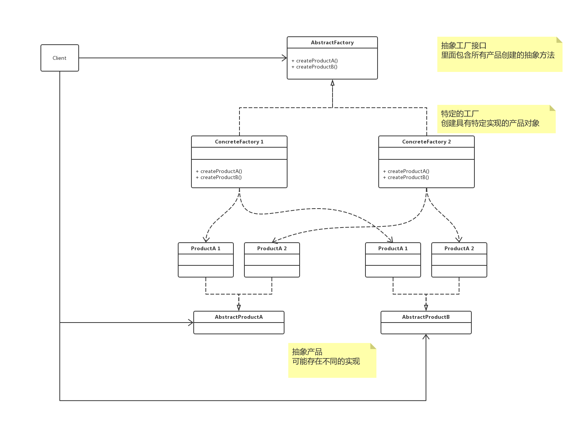

# 概述

**抽象工厂模式（Abstract Factory）**，提供一个创建一系列相关或相互依赖对象的接口，而无需指定它们具体的类。

# UML



## 解析

 `AbstractProductA` 和 `AbstractProductB` 是两个抽象产品，之所有为抽象，是因为它们都有可能有两种不同的实现，例如 `ProductA1` 、 `ProductA2` 和 `ProductB1` 、 `ProductB2` 就是对两个抽象产品的具体实现。

`IFactory` 是一个抽象工厂接口，里面包含了所有的产品创建的抽象方法。

通常是在运行时刻再创建一个 `ConcreteFactory` 类的实例，这个具体的工厂再创建具有特定实现的产品对象，也就是说，为创建不同的产品对象，客户端应使用不同的具体工厂。

## 优点与缺点

好处：

1. 易于交换产品系列，由于具体工厂类，在一个应用中只需要在初始化的时候出现一次，这就使得改变一个应用的具体工厂变得非常容易，它只需要改变具体工厂即可使用不同的配置。
2. 它让具体的创建实例过程与客户端分离，客户端通过它们的抽象接口操作实例，产品的具体类名也被具体工厂的实现分离，不会出现客户端代码中。

缺点：

增加功能的时候，需要修改 `Product`、`Factory`等。


# Talk is cheap，just coding

## Java

### base

```java
interface AbstractProductA {
    void execute();
}

interface AbstractProductB {
    void run();
}

class ProductA1 implements AbstractProductA {

    @Override
    public void execute() {
        System.out.println("ProductA1");
    }
}

class ProductA2 implements AbstractProductA {

    @Override
    public void execute() {
        System.out.println("ProductA2");
    }
}

class ProductB1 implements AbstractProductB {

    @Override
    public void run() {
        System.out.println("ProductB1");
    }
}

class ProductB2 implements AbstractProductB {

    @Override
    public void run() {
        System.out.println("ProductB2");
    }
}

interface AbstractFactory {
    AbstractProductA createProductA();

    AbstractProductB createProductB();
}

class ConcreteFactory1 implements AbstractFactory {

    @Override
    public AbstractProductA createProductA() {
        return new ProductA1();
    }

    @Override
    public AbstractProductB createProductB() {
        return new ProductB1();
    }
}

class ConcreteFactory2 implements AbstractFactory {

    @Override
    public AbstractProductA createProductA() {
        return new ProductA2();
    }

    @Override
    public AbstractProductB createProductB() {
        return new ProductB2();
    }
}
@Test
public void test() {
    AbstractFactory abstractFactory = new ConcreteFactory1();
    AbstractProductA productA = abstractFactory.createProductA();
    AbstractProductB productB = abstractFactory.createProductB();
    productA.execute();
    productB.run();
}
```

### Java SPI Support

> 非 dubbo SPI 
>
> http://dubbo.apache.org/zh-cn/docs/source_code_guide/dubbo-spi.html

在 `resource` 下创建 `META-INF/services` 创建一个文件，名称为 类 `AbstractFactory` 的全量名 `com.example.demo.design.abstractfactory.AbstractFactory` ，文件内容为实现类的全量名

```java
com.example.demo.design.abstractfactory.ConcreteFactory1
# com.example.demo.design.abstractfactory.ConcreteFactory2
```

```java
@Test
public void test1() {
    ServiceLoader<AbstractFactory> load = ServiceLoader.load(AbstractFactory.class);
    load.forEach(e -> {
        e.createProductA().execute();
        e.createProductB().run();
        System.out.println("------------------------");
    });
}
// ProductA1
// ProductB1
// ------------------------
// ProductA2
// ProductB2
// ------------------------
```

## go

> todo

