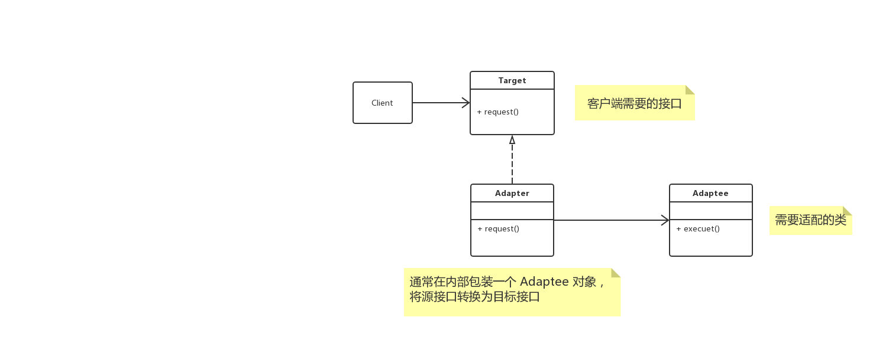

# 概述

**适配器模式（Adapter）**，将一个类的接口转换成客户端希望的另外一个接口。 `Adapter` 模式使得原本由于接口不兼容而不能一起工作的类可以一起工作。

系统的数据和行为都正确，但接口不符合时，应该考虑用适配器，目的是使控制范围之外的一个原有对象与某个接口匹配。适配器模式主要应用于希望复用一些现存的类，但接口又于复原环境要求不一致的情况。

在`GoG` 的设计模式中，适配器模式有两种类型，**类适配器模式**和**对象适配器模式**，由于类适配器模式通过多重继承对一个接口与另外一个接口进行匹配，而Java等语言不支持多重继承，所以主要讲解的是**对象适配器模式**。

# UML



# 使用时机

使用一个已经存在的类，但如果它的接口，也就是它的方法和客户端的要求不相同时，就应该考虑使用适配器模式。

# Talk is cheap, just coding

## Java

```java
interface Target {
    void request();
}

class Adapter implements Target {
    private Adaptee adaptee;

    public Adapter(Adaptee adaptee) {
        this.adaptee = adaptee;
    }

    @Override
    public void request() {
        adaptee.execute();
    }
}

class Adaptee {
    void execute() {
        System.out.println(this.getClass().getName());
    }
}

@Test
public void test(){
    Target target = new Adapter(new Adaptee());
    target.request();
}

// com.ancda.palmbaby.hm.modules.school.service.affairs.Adaptee
```

## go

> todo

