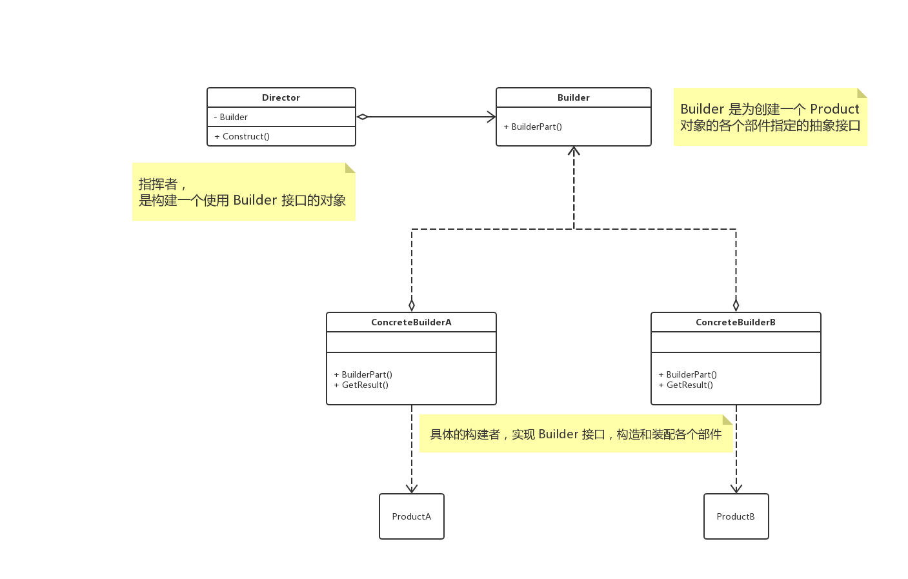

# 概述

**建造者模式（Builder）**，将一个复杂对象的构建与它的表示分离，使得同样的构建过程可以创建不同的表示。

该模式中包含一个很重要的类，**指挥者（Director）**，用它来控制建造过程，也用它来隔离客户端与建造过程的关联。

# UML



## 解析

建造者模式是在创建复杂对象的算法应该独立于该对象的组成部分以及它们的装配方式时适用的模式。

### Builder

概括地说，是为创建一个 `Product` 对象的各个部件指定的抽象接口。

### ConcreteBuilder

具体的建造者，实现了 `Builder` 接口，构造和装配各个部件。产生 `Product` 。

### Director

构建一个使用 `Builder` 接口的对象。

主要是用于创建一些复杂的对象，这些对象内部构建间的建造顺序通常是稳定的，但对象内部的构建通常面临这复杂的变化。

## 好处

使得建造代码与表示代码分离，由于建造者隐藏了产品是如何组装的，所以若需要改变一个产品的内部表示，只需要再定义一个具体的建造者即可。

遵循**开放-封闭原则**

# Talk is cheap，just coding.

## Java

```java
class Product {
    public String partA;
    public String partB;
    public String partC;
}

interface Builder {
    Builder buildPartA();

    Builder buildPartB();

    Builder buildPartC();

    Product get();
}

class ConcreteBuilder implements Builder {

    private Product product;

    public ConcreteBuilder() {
        product = new Product();
    }

    @Override
    public Builder buildPartA() {
        product.partA = "A";
        return this;
    }

    @Override
    public Builder buildPartB() {
        product.partB = "B";
        return this;
    }

    @Override
    public Builder buildPartC() {
        product.partC = "C";
        return this;
    }

    @Override
    public Product get() {
        return product;
    }
}

class Director {

    private Builder builder;

    public Director(Builder builder) {
        this.builder = builder;
    }

    public Product construct() {
        builder.buildPartA();
        builder.buildPartB();
        builder.buildPartC();
        return builder.get();
    }
}
```

## go

> todo

