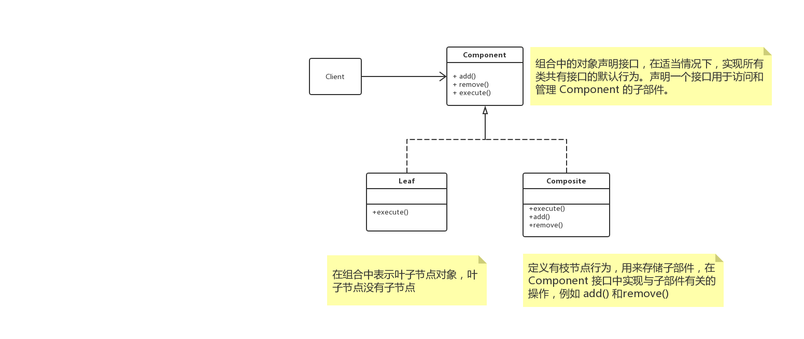

# 概述

**组合模式（Composite）**，将对象组合成**树形结构**以表示“部分-整体”的层次结构。组合模式使得客户端对单个对象和组合对象的使用具有一致性。

# UML



## 解析

### Component

为组合中的对象声明接口，在适当情况下，实现所有类共有接口的默认行为。

声明一个接口用于访问和管理 `Component` 的子部件。

### Composite

定义有枝节点行为，用来存储子部件，在 `Component` 接口中实现与子部件有关的操作，比如 `add()` 和 `remove()`

### Leaf

在组合中表示叶子节点对象，叶子节点没有子节点。

# 透明方式与安全方式

## 透明方式

在 `Component` 中声明所有用来管理子对象的方法，其中包含 `add()`、`remove()` 等。这样实现 `Component` 接口的所有子类都具备了 `add()` 和 `remove()` 。这样做的好处就是叶子节点和枝节点对于外界是没有区别，它们具备完全一致的行为接口。但问题也很明显，因为 `Leaf` 类本身不具备 `add()`、`remove()` 方法的功能，所以实现它是没有意义的。

## 安全方式

在 `Component` 接口中不去声明  `add()`、`remove()`  方法，那么子类 `Leaf` 也就不需要去实现它，而是在 `Composite` 声明所有用来管理子类对象的方法。不过由于不够透明，所以树叶和树枝类将不具有相同的接口，客户端的调用需要做出相应的判断。

# 使用时机

需求中是体现部分与整体层次的结构时，希望客户端可以忽略组合对象与单个对象的不同，统一地使用组合结构中的所有对象时，就应该考虑组合模式了。

# Talk is cheap ，just coding

## Java

```java
abstract class Component {
    protected String name;

    public abstract boolean add(Component component);

    public abstract boolean remove(Component component);

    public abstract void execute();
}

class Composite extends Component {

    private List<Component> children;

    public Composite(String name) {
        this.name = name;
        this.children = new ArrayList<>();
    }

    @Override
    public boolean add(Component component) {
        return children.add(component);
    }

    @Override
    public boolean remove(Component component) {
        return children.remove(component);
    }

    @Override
    public void execute() {
        System.out.println(toString());
    }

    @Override
    public String toString() {
        return "Composite{" +
                "name='" + name + '\'' +
                ", children=" + children +
                '}';
    }
}

class Leaf extends Component {
    public Leaf(String name) {
        this.name = name;
    }

    @Override
    public boolean add(Component component) {
        return false;
    }

    @Override
    public boolean remove(Component component) {
        return false;
    }

    @Override
    public void execute() {
        System.out.println(toString());
    }

    @Override
    public String toString() {
        return "Leaf{" +
                "name='" + name + '\'' +
                '}';
    }
}
@Test
public void test3() {
    Composite root = new Composite("root");
    root.add(new Leaf("left"));
    root.add(new Leaf("right"));
    Composite middle = new Composite("middle");
    middle.add(new Leaf("middle-left"));
    middle.add(new Leaf("middle-right"));
    root.add(middle);
    root.execute();
}
// Composite{name='root', children=[Leaf{name='left'}, Leaf{name='right'}, Composite{name='middle', children=[Leaf{name='middle-left'}, Leaf{name='middle-right'}]}]}
```

## go

> todo

