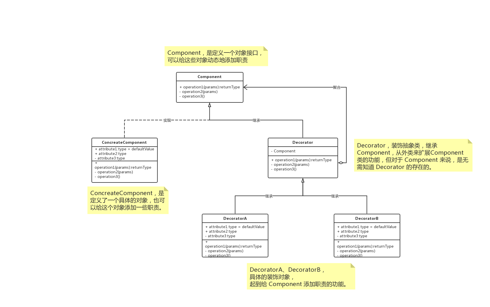

# 概述

**装饰模式（`decorator`）**，动态地给一个对象添加一些额外的职责，就增加功能来说，装饰模式比生成子类更为灵活。

# UML



**`Component `是定义了一个对象接口，可以给这些对象动态添加职责。 `ConcreteComponent `是定义了一个具体的对象，也可以给这个对象添加一些职责。 `Decorator `，装饰抽象类，继承了 `Component`，从外类来扩展 `Component `类的功能，但对于 `Component `来说，是无需知道 `Decorator `的存在的。至于 `DecoratorA`、 `DecoratorB `就是具体的装饰对象，起到给 `Component `添加职责的功能。**


# 总结

装饰模式是为已有功能动态地添加更多功能的一种方式。

当程序需要新功能的时候，是向就的类中添加新的代码。这些新加的代码通常装饰了原有类的核心职责或主要行为。这种做法的问题在于，它们在主类中加入了新的字段，新的方法，新的逻辑，从而增加了主类的复杂性，而这些新加入的东西仅仅是为了满足一些只在某种特定情况下才会执行特殊行为的需要。

装饰模式提供了一个非常好的解决方案，它把每个要装饰的功能放在单独的类中，并让这个类包装它所要装饰的对象，因此，当需要执行特殊行为时，客户代码就可以运行在根据需要有选择地、顺序地使用装饰功能包装对象了。

## 优点

把类中的装饰功能从类中搬移去除，简化原有的类。

有效的把类的核心职责和装饰功能分开了，而且可以去除相关类中重复的装饰逻辑。


# Talk is cheap, just coding.

## 代码解读

装饰模式是利用 `setComponent `来将对象进行包装的。这样每个对象的实现就和如何使用这个对象分离开了，每个装饰对象只关心自己的功能，不需要关心如何被添加到对象链当中。

如果只有一个 `ConcreteComponent `类而没有抽象的 `Component `类，那么 `Decorator `类可以是 `ConcreteComponent `的一个子类。同样道理，如果只有一个 `ConcreteDecorator `(Decora)类，那么就没有必要建立一个单独的 `Decorator`类，而可以把 `Decorator `和 `ConcreteDecorator` 的责任合并成一个类。

## Java

```java
interface Component {
    void operate();
}

class ConcreteComponent implements Component {
    @Override
    public void operate() {}
}

@Data
abstract class Decorator implements Component {
    protected Component component;
    public void operate() {
        if (Objects.nonNull(component)) {
            component.operate();
        }
    }
}

class DecoratorA extends Decorator {
    @Override
    public void operate() {
        aBefore();
        super.operate();
        aAfter();
    }
    private void aAfter() {}
    private void aBefore() {}
}

class DecoratorB extends Decorator {
    @Override
    public void operate() {
        bBefore();
        super.operate();
        bAfter();
    }
    private void bAfter() {}
    private void bBefore() {}
}

class Client {
    public static void main(String[] args) {
        ConcreteComponent c = new ConcreteComponent();
        // 第一次装饰， a 装饰具体的对象 c
        DecoratorA a = new DecoratorA();
        a.setComponent(c);
        // 第二次装饰， b 装饰 a
        DecoratorB b = new DecoratorB();
        b.setComponent(a);
        // 具体的执行为 b -> a -> c
        b.operate();
    }
}

```

## go

> todo

