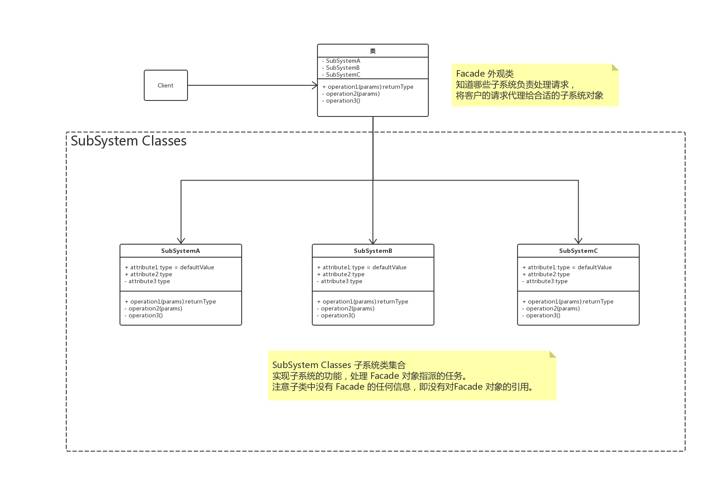
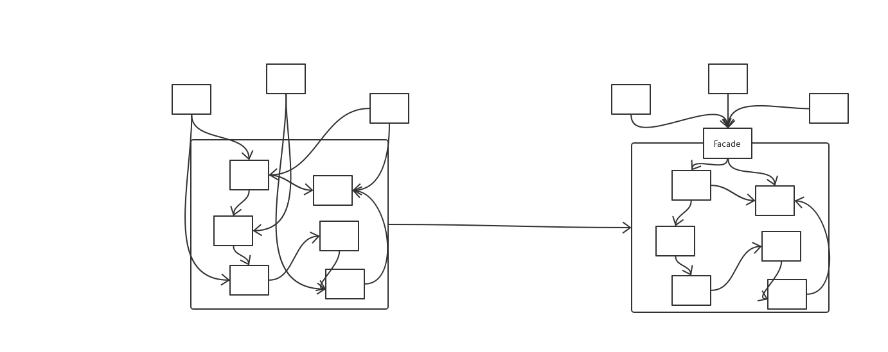

# 概述

**外观模式（Facade）**，为子系统中的一组接口提供了一个一致的界面，此模式定义了一个高层接口，这个接口使得这一子系统更加容易使用。

# UML




# 使用时机

首先，在涉及初期阶段，应该要有意识的将不同的两个层分离，例如经典的三层架构，在数据访问层、业务逻辑层、表示层的层与层之间建立外观 Facade，这样可以为复杂的子系统提供一个简单的接口，大大降低耦合度。

其次，在开发阶段，子系统往往因为不断的重构演化而变得越来越复杂，增加外观 Facade 可以提供一个简单的接口，减少它们的依赖。

第三，在维护一个遗留的大型系统时候，可能这个系统已经非常难以维护和扩展，为新系统开发一个外观 Facade 类，来提供设计粗糙或高度复杂的遗留代码的比较清晰的简单的接口，让新系统与 Facade 对象交互， Facade 与遗留代码交互所有复杂的工作。



# Talk is cheap，just coding

## Java

```java
class ConcreteA {
    void execute() {

    }
}

class ConcreteB {
    void execute() {

    }
}

class ConcreteC {
    void execute() {

    }
}

class Facade {
    private ConcreteA a;
    private ConcreteB b;
    private ConcreteC c;

    private void executeA() {
        a.execute();
    }

    private void executeB() {
        b.execute();
    }

    private void executeV() {
        c.execute();
    }
}
```

## go

> todo

