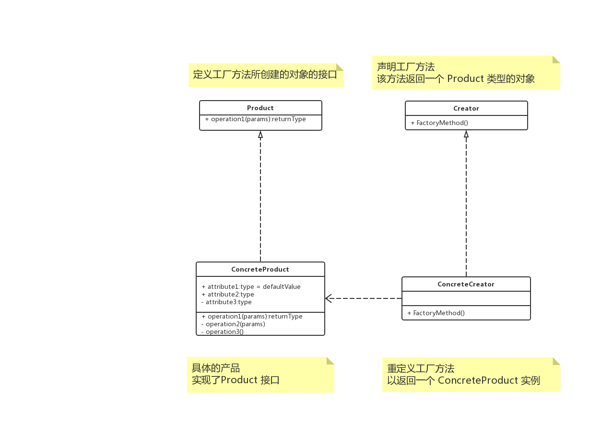

# 概述

**工厂方法模式（Factory Method）**，定义一个用于创建对象的接口，让子类决定实例化哪一个类。

工厂方法使一个类的实例化延迟到其子类。

# 简单工厂 vs 工厂方法

简单工厂模式的最大优点在于工厂类中包含了必要的逻辑判断，根据客户端的选择条件动态实例化相关的类，对于客户端来说，去除了与具体产品的依赖。

但是这种做法违背了**开放-封闭原则**。

# UML




# 解析

工厂方法模式实现时，客户端需要决定实例化哪一个工厂来实现具体的类，选择判断的问题还是存在的，也就是说，工厂方法把简单工厂的内部逻辑判断移到了客户端层面来。如果需要增加功能，简单工厂模式是修改工厂类的，而工厂方法模式需要修改客户端。


# Talk is cheap, just coding

## Java

```java
interface Product {
    void execute();
}

class ConcreteProduct implements Product {

    @Override
    public void execute() {

    }
}

interface Creator {
    Product factory();
}

class ConcreteCreator implements Creator {

    @Override
    public Product factory() {
        return new ConcreteProduct();
    }
}
```

## go

> todo

