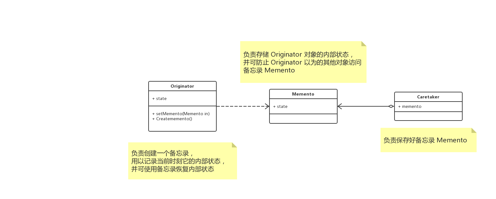

# 概述

**备忘录模式（Memento）**，在不破坏封装性的前提下，捕获一个对象的内部状态，并在该对象之外保存这个状态。这样以后就可将该对象恢复到原先保存的状态。

# UML 



## 解析

### Originator

发起人，负责创建一个备忘录 `Memento` ，用以记录当前它的内部状态，并可使用备忘录恢复内部状态。`Originator` 可根据需要决定 `Memento` 存储 `Originator` 的哪些内部状态。

### Memento

备忘录，负责存储 `Originator`  对象的内部状态，并可防止 `Originator` 以外的其他对象访问备忘录 `Memento`。 备忘录有两个接口， `Caretaker` 只能看到备忘录的窄接口，它稚嫩恶搞将备忘录传递给其他对象。`Originator` 能看到一个宽接口，允许它访问返回先前状态所需的所有数据。

### Caretaker

管理者，负责保存好备忘录 `Memento` ，不能对备忘录的内容进行操作或检查。

# 总结

`Memento` 模式比较适用于功能比较复杂的，但需要维护或记录属性历史的类，或者需要保存的属性只是众多属性中的一小部分是， `Originator` 可以根据保存的 `Memento` 信息还原到前一状态。


# Talk is cheap, just coding

## Java

```java

@Data
class Memento {
    private String state;

    public Memento(String state) {
        this.state = state;
    }
}

@Data
class Originator {
    private String state;

    public Originator(String state) {
        this.state = state;
    }

    public Memento createMemento() {
        return new Memento(state);
    }

    public void rollback(Memento memento) {
        this.state = memento.getState();
    }

    @Override
    public String toString() {
        return "Originator{" +
                "state='" + state + '\'' +
                '}';
    }
}

@Data
class Caretaker {
    private Memento memento;
}

@Test
public void test2() {
    Originator originator = new Originator("start");
    System.out.println(originator);

    Caretaker caretaker = new Caretaker();
    caretaker.setMemento(originator.createMemento());

    originator.setState("you died");
    System.out.println(originator);

    originator.rollback(caretaker.getMemento());
    System.out.println(originator);
}

// Originator{state='start'}
// Originator{state='you died'}
// Originator{state='start'}
```

## go

> todo

