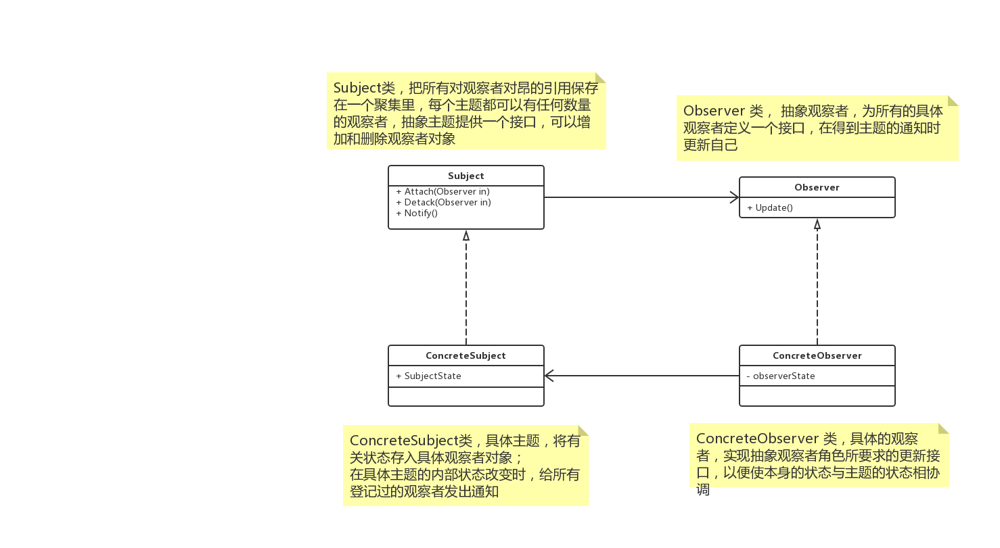

# 概述

**观察者模式（observer）**，又叫做**发布-订阅模式（Publish-Subscribe）**，定义了一种一对多的依赖关系，让多个观察这对象同时监听某一个主题对象。这个主题对象在状态发生变化时，会通知所有观察者对象，使它们能够自动更新自己。

# UML



## 解析

### Subject

可翻译为主题或抽象通知者，一般用一个抽象类或者接口实现。它把所有对观察者对象的引用保存在一个聚集里，每个主题都可以有任何数量的观察者。抽象主题提供一个接口，可以增加和删除观察者对象。

### Observer

抽象观察者，为所有的具体观察者定义一个接口，在得到主题的通知时更新自己。

这个接口叫做更新接口。

抽象观察者一般用一个抽象类或者一个接口实现。

更新接口通常包含一个 Update() 方法，这个方法叫做更新方法。

### ConcreteSubject

具体主题或者具体通知者，将有关状态存在具体观察者对象；

在具体主题的内部状态改变时，给所有登记过的观察者发出通知。

### ConcreteObserver

具体观察者，实现抽象观察者接口所要求的更新接口，以便使自身的状态与主题的状态相协调。

具体观察者角色可以保存一个指向具体主题对象的引用。

## 特点

将一个系统分割成一系列相互写作的类有一个很不好的副作用，就是需要维护相关对象间的一致性。我们不希望为了维持一致性而使各类紧密耦合，这样会给维护、拓展、重用带来不变。

观察者模式所做的工作其实就是在解除耦合，让耦合的双方都依赖于抽象，而不是依赖于具体，从而使得各自的变化都不会影响另一边的变化。


# Talk is cheap，just coding

## Java

```java

interface Observer {
    void update();
}

abstract class Subject {

    protected List<Observer> list;

    protected void init() {
        list = new ArrayList<>();
    }

    public boolean attach(Observer observer) {
        return list.add(observer);
    }

    public boolean detach(Observer observer) {
        return list.remove(observer);
    }

    public void doNotify() {
        list.stream().forEach(e -> e.update());
    }
}

class ConcreteSubject extends Subject {
    public String subjectState;

    public ConcreteSubject() {
        super.init();
        subjectState = "start";
    }
}

class ConcreteObserver implements Observer {

    public String name;
    public String observerState;
    public ConcreteSubject subject;

    public ConcreteObserver(String name, ConcreteSubject subject) {
        this.name = name;
        this.subject = subject;
        this.observerState = subject.subjectState;
    }

    @Override
    public void update() {
        observerState = subject.subjectState;
        System.out.println(String.format("name: %s，observerState：%s", name, observerState));
        // TODO: something...
    }
}

@Test
public void test4() {
    ConcreteSubject subject = new ConcreteSubject();
    subject.attach(new ConcreteObserver("1", subject));
    subject.attach(new ConcreteObserver("2", subject));
    subject.attach(new ConcreteObserver("3", subject));
    subject.subjectState = "down";
    subject.doNotify();
}
// name: 1，observerState：down
// name: 2，observerState：down
// name: 3，observerState：down
```

## go

> todo

