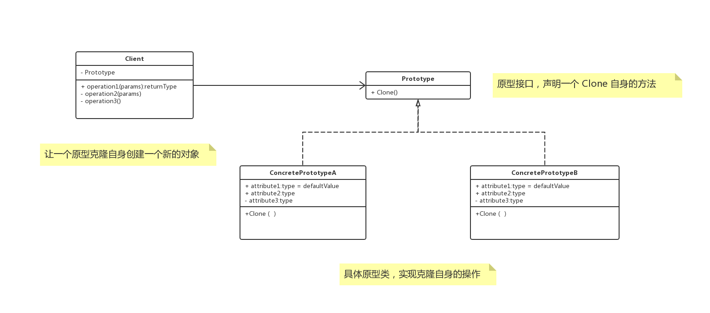

# 概述

**原型模式（prototype）**，用原型实例指定创建对象的种类，并且通过拷贝这些原型创建新的对象。

# UML



原型模式就是从一个对象再创建另外一个可定制的对象，而且不需要知道任何创建的细节。


# 浅复制与深复制

## 浅复制

被复制对象的所有变量都含有与原来的对象相同的值，而所有的对其他对象的引用都仍然指向原来的对象。

## 深复制

把引用对象的变量指向复制过的新对象，而不是原有的被引用的对象。

# Talk is cheap，just coding

## java

```java
class ProtoType implements Cloneable{
    private String name;

    @Override
    protected ProtoType clone() throws CloneNotSupportedException {
        return (ProtoType)super.clone();
    }
}
@Test
public void client(){
    ProtoType protoType1 = new ProtoType();
    System.out.println(protoType1);
    try {
        ProtoType clone = protoType1.clone();
        System.out.println(clone);
    } catch (Exception e) {

    }
}
// com.example.demo.ProtoType@368239c8
// com.example.demo.ProtoType@9e89d68

```

### 补充

在 Java 的 Object.clone() 描述中提到

> Thus, this method performs a "shallow copy" of this object, not a "deep copy" operation.

即，Java 的 Clone() 为 **浅复制** 。


## go

> todo