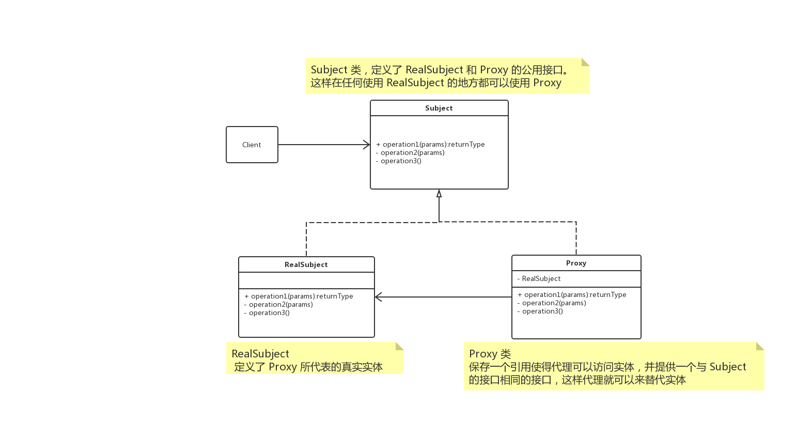

# 概述

**代理模式（Proxy）**，为其他对象提供一种代理以控制对这个对象的访问。

# UML



`Subject` 接口，定义了 `RealSubject ` 和 `Proxy ` 的共用接口，这样在任何使用 `RealSubject ` 的地方都可以适应 `Proxy ` 。


# 应用

## 远程代理

为一个对象在不同的地址空间提供局部代表。

这样可以隐藏一个对象存在于不同地址空间的事实。

## 虚拟代理

根据需要创建开销很大的对象。

通过它来存放实例化需要很长时间的真实对象。

## 安全代理

用来控制真实对象访问时的权限。

## 智能指引

当调用真实的对象时，代理处理另外一些事。

例如：

+ 计算真实对象的引用次数，这样当该对象没有引用时，可以自动释放它
+ 当第一次引用一个持久对象时，将它装入内存；
+ 在访问一个实际对象之前，检查是否已经锁定它，以确保其他对象不能改变它。


# Talk is cheap, just coding.

## Java

```java
interface Subject {
    void execute();
}

class RealSubject implements Subject {

    @Override
    public void execute() {

    }
}

@Data
class Proxy implements Subject {

    private Subject subject;

    @Override
    public void execute() {
        if (Objects.nonNull(subject)) {
            subject.execute();
        }
    }
}
```


## go

> todo