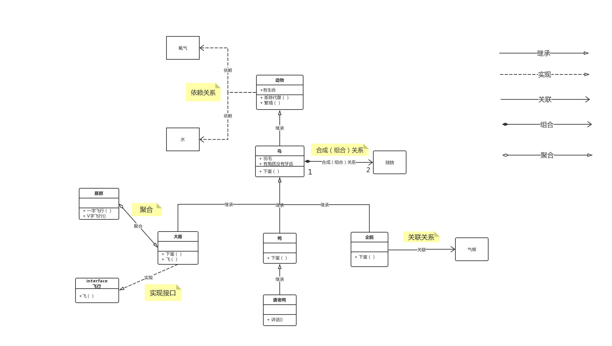

# 大话设计模式

> 《大话设计模式》笔记

## 面向对象的好处

**通过封装、继承、多态把程序的耦合度降低，使用设计模式使得程序更加的灵活，容易修改，并且易于服用**

## UML

### 继承

空心三角形 + 实线

### 实现

空心三角形 + 虚线

### 关联

实线箭头

### 聚合

**一种“弱”的‘拥有’关系，体现的是A对象可以包含B对象，但B对象不是A对象的一部分**

空心的菱形 + 实线箭头

### 合成

**一种“强”的‘拥有’关系，体现了严格的部分和整体的关系，部分和整体的生命周期一样**

实心的菱形 + 实线箭头

### 依赖

虚线箭头

## 模式

* [简单工厂模式](designpatterns/simplefactory/readme.md)
* [策略模式](designpatterns/strategy/readme.md)
* [装饰模式](designpatterns/decorator/readme.md)
* [代理模式](designpatterns/proxy/readme.md)
* [工厂方法模式](designpatterns/factory/readme.md)
* [原型模式](designpatterns/prototype/readme.md)
* [模板方法模式](designpatterns/template/readme.md)
* [外观模式](designpatterns/facade/readme.md)
* [建造者模式](designpatterns/builder/readme.md)
* [观察者模式](designpatterns/observer/readme.md)
* [抽象工厂模式](designpatterns/abstract/readme.md)
* [状态模式](designpatterns/state/readme.md)
* [适配器模式](designpatterns/adapter/readme.md)
* [备忘录模式](designpatterns/memento/readme.md)
* [组合模式](designpatterns/composite/readme.md)
* [单例模式](designpatterns/singleton/readme.md)