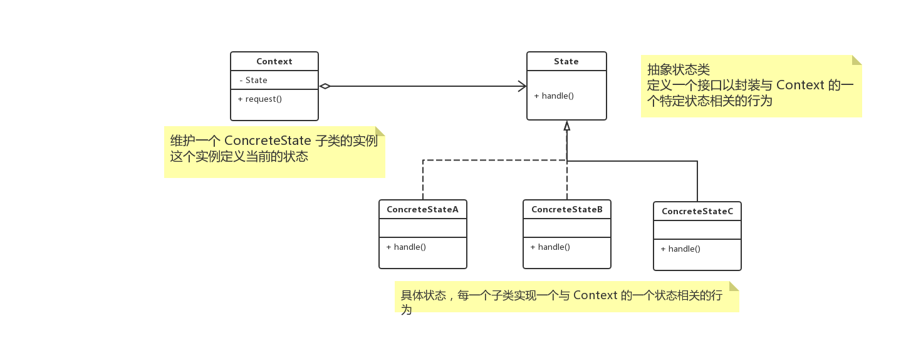

# 概述

**状态模式（state）**，当一个对象的内在状态改变时允许改变其行为，这个对象看起来像是改变了其类。

状态模式主要解决的是当控制一个对象状态转换的条件表达式过于复杂时的情况。把状态判断逻辑转移到表示不同状态的一系列类当中，可以把复杂的逻辑简化。

# UML



# 好处与用处

状态模式的好处就是将与特定状态相关的行为局部化，并且将不同状态的行为分割开。

将特定的状态相关的行为都放在一个对象中，由于所有与状态相关的代码都存在于某一个 `COncreteState` 中，所有通过定义新的子类可以很容易地增加新的状态和转换。

状态模式通过把各种状态转移逻辑分布到 `State` 的子类之间，来减少相互的依赖。

当一个对象的行为取决于它的状态，并且它必须在循行时刻根据状态改变它的行为时，就可以考虑使用状态模式了。

# Talk is cheap ， just coding

## Java

```java
class Context {
    public State state;

    public Context(State state) {
        this.state = state;
    }

    public void request() {
        state.handle(this);
    }
}

interface State {
    void handle(Context context);
}

class ConcreteStateA implements State {

    @Override
    public void handle(Context context) {
        System.out.println("ConcreteStateA handle successful! Next is ConcreteStateB");
        context.state = new ConcreteStateB();
    }
}

class ConcreteStateB implements State {

    @Override
    public void handle(Context context) {
        System.out.println("ConcreteStateB handle successful! Next is ConcreteStateA");
        context.state = new ConcreteStateA();
    }
}

@Test
public void test() {
    Context context = new Context(new ConcreteStateA());
    for (int i = 0; i < 5; i++) {
        context.request();
    }
}
// ConcreteStateA handle successful! Next is ConcreteStateB
// ConcreteStateB handle successful! Next is ConcreteStateA
// ConcreteStateA handle successful! Next is ConcreteStateB
// ConcreteStateB handle successful! Next is ConcreteStateA
// ConcreteStateA handle successful! Next is ConcreteStateB
```

## go

> todo

