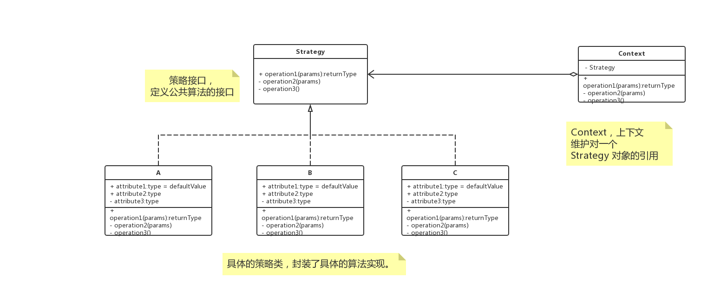

> 面向对象的编程，并不是类越多越好，类的划分是为了封装，但分类的基础是抽象，具有相同属性和功能的抽象集合才是类


# 概述

**策略模式（strategy）**：定义了算法家族，分别封装起来，让它们之间可以相互转化，此模式让算法的变化，不会不影响到使用算法的客户端。

# UML





# 解析

策略模式的 Strategy 接口为 Context 定义了一系列的可供重用的算法或行为。继承有利于解析取出这些算法中的公共功能。


简化了单元测试，每个算法都可以有自己的类，可以通过自己的接口单独测试。


当不同的行为堆砌在一个类中时候，很难避免使用条件语句进行选择合适的行为，将这些行为封装在一个个**独立**的 Strategy 类中，可以在使用这些行为的时候消除条件语句。


在基础的策略模式中，选择所用具体实现的职责有客户段对象承担，并转给策略模式的 Context 对象。


# Talk is cheap, just coding

## Java

### 简单实现

```java
interface Strategy {
    int execute();
}

class StrategyA implements Strategy {
    @Override
    public int execute() {
        return 0;
    }
}

class Context {
    
    private Strategy strategy;

    private Context() {
    }

    public Context(Strategy strategy) {
        this.strategy = strategy;
    }

    public int execute() {
        return strategy.execute();
    }
}
```


### 结合简单工厂模式

```java
interface Strategy {
    int execute();
}

class StrategyA implements Strategy {
    @Override
    public int execute() {
        return 0;
    }
}

class Context {

    private Strategy strategy;

    private Context() {
    }
    
    public Context(String type){
        switch (type) {
            case "A":
                strategy = new StrategyA();
                break;
            default:
                break;

        }
    }

    public int execute() {
        return strategy.execute();
    }
}
```


## go

> todo