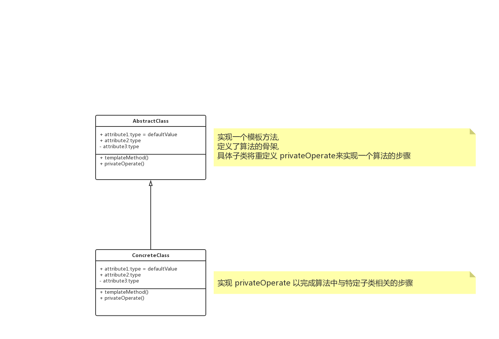

# 概述

**模板方法模式（TemplateMethod）**，定义一个操作中的算法的股价，而将一些步骤延迟到子类中。模板方法使得子类可以不改变一个算法的结构即可重定义该算法的某些特定步骤。

# UML



 `AbstractClass ` 是抽象类，其实也就是一个抽象模板，定义并实现了一个模板方法，给出了一个顶级逻辑的股骨架，而逻辑的组成步骤在相应的抽象操作中，推迟到子类实现。

`ConcreteClass `，实现父类所定义的一个或多个抽象方法。

# 特点

模板方法模式是通过把不变行为搬移到超类，去除子类中的重复代码，此模式提供了一个很好的代码复用平台。

当不变的和可变的行为在方法的子类实现中混合在一起的时候，不变的行为就会在子类中重复出现。可以通过模板方法模式把这些行为搬移到单一的地方，这样就帮助子类摆脱重复的不变行为的纠缠。

# Talk is cheap，just coding.

## Java

```java
abstract class AbstractClass {
    public void execute() {
        doExecute();
    }

    protected abstract void doExecute();
}

class ConcreteClass extends AbstractClass {

    @Override
    protected void doExecute() {
        
    }
}
```

## go

> todo