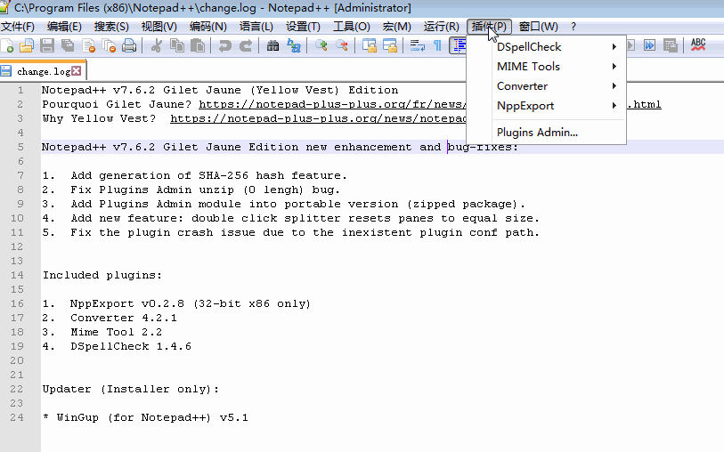
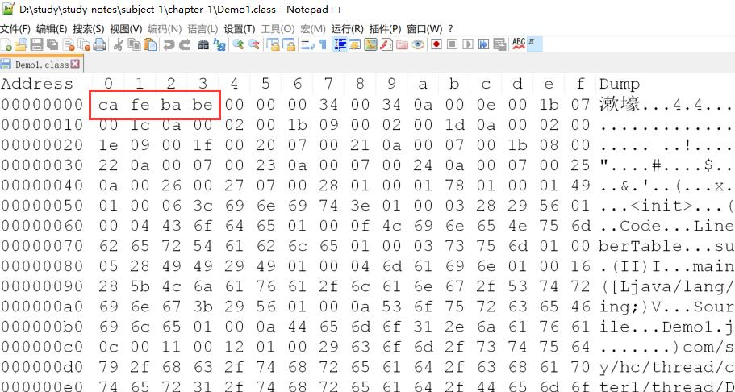

> 转载  <https://github.com/xuqifzz>


# JAVA程序运行原理分析

## 16进制查看工具Notepad++ 
* 下载地址: https://notepad-plus-plus.org/download
* 可以通过安装插件的方式以16进制的方式查看文件内容
* 插件安装方法如下图所示:
* 
* 安装好插件后,可以使用`Ctrl+Alt+Shift+H`切换16进制显示

## JVM指令表
[JVM指令表](https://static.xuqi.io/JVM.html) 


## 编译java文件后查看内容
```
javac Demo1.java
javap -v Demo1.class > Demo1.txt
```


[查看生成结果:Demo1.txt](Demo1.txt)

## 默认的构造函数
```java
  public com.study.hc.thread.chapter1.thread.Demo1();
    descriptor: ()V
    flags: ACC_PUBLIC
    Code:
      stack=1, locals=1, args_size=1
         0: aload_0
         1: invokespecial #1                  // Method java/lang/Object."<init>":()V
         4: return
      LineNumberTable:
        line 6: 0
```
* 因为代码中没有显示定义Demo1的构造函数,因此javac生成了一个默认的无参构造函数
* 这个构造函数因为存在一个隐含的this参数,所以locals以及args_size都为1 
* 因为使用this参数调用了父类的初始化方法(`<init>`),所以需要将this先入栈`aload_0`,然后在用`invokespecial #1`进行调用,这就是stack=1的原因.
* `invokespecial #1`表示调用常量表中的第1项,即:
> #1 = Methodref          #14.#27        // java/lang/Object."<init>":()V
* 此处引用的是一个方法引用,再顺腾摸瓜,可以找到相关的所有内容
```
#14 = Class              #40            // java/lang/Object
#27 = NameAndType        #17:#18        // "<init>":()V
#40 = Utf8               java/lang/Object
#17 = Utf8               <init>
#18 = Utf8               ()V
```

# 线程状态
* 本课老师提到在java中,线程状态runnable包括了ready和running两种状态,而不做区分
* 通过进一步跟同学们讨论发现,发现做这种区分可能对java来说确实意义不大,[讨论帖地址](https://course.study.163.com/400000003517151/post-400000000171004-1-1)
* 我之前没学过java,但搞过几年C++,出于好奇心,还是想看看究竟是怎么回事.于是写了几段代码进行测试.

## 测试结论
先说测试结论吧
* 在java层面,无论是线程ID,线程名称,还是线程优先级,这些都跟操作系统底层的类似概念没有对应关系,虽说在Hotspot 中java的Thread对象与操作系统中的线程有一一对应的关系,但似乎很难找到对应依据.
* 跟预想的一样,确实可能有大量线程处在ready的情况.
* 除了主线程和你自己启动的线程外,JVM还背地里启动了很多线程

## 测试思路
1. 编写一段java程序,首先输出进程ID.
2. 然后在代码中启动20个工作线程,将这些线程的优先级设置到最低,运行5秒后,在主线程输出这些工作线程的状态.
3. 使用其他语言编写一段代码(比如C#),该代码能输出指定进程的所有线程的状态.
4. 代码写完后,首先运行java程序,在获得进程id后,在C#程序中输出该进程的所有线程信息.

## 测试代码
* [ThreadStateTest.java](ThreadStateTest.java)
* [ShowProcessThreads.cs](ShowProcessThreads.cs)

## 运行结果(片段)
java
```
15288@DESKTOP-KA2VO1V
工作线程-0:RUNNABLE
工作线程-1:RUNNABLE
工作线程-2:RUNNABLE
工作线程-3:RUNNABLE
工作线程-4:RUNNABLE
工作线程-5:RUNNABLE
工作线程-6:RUNNABLE
工作线程-7:RUNNABLE
工作线程-8:RUNNABLE
工作线程-9:RUNNABLE
工作线程-10:RUNNABLE
工作线程-11:RUNNABLE
工作线程-12:RUNNABLE
工作线程-13:RUNNABLE
工作线程-14:RUNNABLE
工作线程-15:RUNNABLE
工作线程-16:RUNNABLE
工作线程-17:RUNNABLE
工作线程-18:RUNNABLE
工作线程-19:RUNNABLE
```
c#
```
please input the pid
15288
thread id:11780 priority: Normal        state: Wait
thread id:22456 priority: Normal        state: Wait
thread id:7744  priority: Normal        state: Wait
thread id:4316  priority: Normal        state: Wait
thread id:23388 priority: Normal        state: Wait
thread id:9376  priority: Normal        state: Wait
thread id:16324 priority: Normal        state: Wait
thread id:24640 priority: Normal        state: Wait
thread id:22076 priority: Normal        state: Wait
thread id:11976 priority: Normal        state: Wait
thread id:18584 priority: Highest       state: Wait
thread id:8256  priority: Highest       state: Wait
thread id:18380 priority: AboveNormal   state: Wait
thread id:1560  priority: Highest       state: Wait
thread id:22116 priority: Highest       state: Wait
thread id:11272 priority: Highest       state: Wait
thread id:22364 priority: Highest       state: Wait
thread id:15624 priority: Highest       state: Wait
thread id:12076 priority: Normal        state: Wait
thread id:7656  priority: Highest       state: Wait
thread id:9880  priority: Lowest        state: Ready
thread id:1408  priority: Lowest        state: Ready
thread id:4612  priority: Lowest        state: Ready
thread id:4632  priority: Lowest        state: Ready
thread id:10944 priority: Lowest        state: Ready
thread id:12508 priority: Lowest        state: Running
thread id:17648 priority: Lowest        state: Ready
thread id:23216 priority: Lowest        state: Ready
thread id:11580 priority: Lowest        state: Running
thread id:24996 priority: Lowest        state: Running
thread id:8884  priority: Lowest        state: Ready
thread id:3328  priority: Lowest        state: Ready
thread id:21588 priority: Lowest        state: Ready
thread id:20728 priority: Lowest        state: Ready
thread id:21540 priority: Lowest        state: Ready
thread id:14924 priority: Lowest        state: Ready
thread id:7220  priority: Lowest        state: Ready
thread id:8820  priority: Lowest        state: Ready
thread id:20712 priority: Lowest        state: Ready
thread id:23612 priority: Lowest        state: Ready
```
其中那些优先级为Lowest的线程应该就是java里启动的工作线程,可以看到,其状态大部分都是ready,少数是running,而在java中,统一显示为runnable

# 线程中止
这节课老师介绍了三种线程中止的方式,如下所示:
* stop: 可能会导致线程安全问题,不建议使用
* interrupt: JDK比较推荐的方式
* 标志位: 通过判断标志位主动退出线程

我查阅了一些资料,了解到Java没有提供任何机制来安全的中止线程(似乎其他语言也没有?),它提供的中断(interrupt)是一种协作机制.

老师这节课讲得很快,每个情况都只是点了一下,没有展开讲解,我觉得任务的取消和关闭是一个很复杂的话题,以后有时间的话我会深入研究一下.

# CPU缓存和内存屏障
本节课老师介绍了CPU相关的若干个概念,一般只需要了解概念即可,为以后的线程安全性问题做铺垫,深入研究的话水太深,跟Java关系也不大,因为Java存在的目的就是想让你可以不去深入了解底层知识
* CPU缓存 - 多级缓存
* 缓存同步协议 - MESI协议
* 最终一致性
* 运行时指令重排
* 数据不一致问题
* 乱序执行 - as-if-serial语义
* 内存屏障 - 写内存屏障和读内存屏障

# 线程通信
本节课老师主要介绍了以下3套线程协调API
* suspend/resume
* wait/notify
* park/unpark

老师花了很长的时间来讲解这几种方式的区别, 主要在下面几个方面进行了讨论:
* 是否容易写出死锁代码
* 加锁与解锁顺序问题
* 其他问题,比如同步代码块,许可叠加问题

实际上直到目前为止,我对java的的wait/notify机制需要在同步代码块中执行是不理解的,我查阅了一些文章,这些文章大多都只是解释了一大堆底层原理来为这个设计进行辩护,却都没有提供足够的理由来解释为何要这么设计.这也可能是因为我对Java还不是很了解

我理想中的 wait/notify 应该像是C#中的 `AutoResetEvent`一样,下面是简单介绍
* AutoResetEvent 允许线程通过发信号互相通信。通常，此通信涉及线程需要独占访问的资源。
* 线程通过调用 AutoResetEvent 上的 WaitOne 来等待信号。如果 AutoResetEvent 处于非终止状态，则该线程阻塞，并等待当前控制资源的线程通过调用 Set 发出资源可用的信号。
* 调用 Set 向 AutoResetEvent 发信号以释放等待线程。AutoResetEvent 将保持终止状态，直到一个正在等待的线程被释放，然后自动返回非终止状态。如果没有任何线程在等待，则状态将无限期地保持为终止状态。

从上面的介绍可以看到`AutoResetEvent`的WaitOne/Set就相当于Java的wait/notify,而且没有调用顺序要求.

当作练习,我用java的wait/notify机制实现了一个`AutoResetEvent`,测试代码如下:
```java
Random random = new Random();
AutoResetEvent event = new AutoResetEvent(false);
Thread consumerThread = new Thread(() -> {
    try {
        //随机等待一段时间后去买包子
        Thread.sleep(random.nextInt(5000));
        System.out.println("1、去买包子");
        event.waitOne();
        System.out.println("2、买到包子，回家");
    } catch (InterruptedException e1) {
        e1.printStackTrace();
    }
});
consumerThread.start();
// 随机等待一段时间后，生产一个包子
Thread.sleep(random.nextInt(5000));
System.out.println("3、通知消费者");
event.set();
```

生产者和消费者启动的时间是随机的,谁都有可能先执行,但并不会死锁,结果只能是以下两者之一
```
1、去买包子
3、通知消费者
2、买到包子，回家
```
```
3、通知消费者
1、去买包子
2、买到包子，回家
```
[完整代码](AutoResetEvent.java)


# 线程封闭之ThreadLocal和栈封闭
这节课老师介绍了线程封闭的概念,以及ThreadLocal和栈封闭,其思路就是将不需要在线程间共享的数据封闭在线程中,从而杜绝线程安全问题.

ThreadLocal可以理解为JVM维护了一个Map<Thread,T>,每个线程要用这个T的时候,用当前线程去Map里取.

最后,老师仅仅花了30秒讲解栈封闭
> 局部变量的固有属性之一就是封闭在线程中
> 他们位于执行线程的栈中,其他线程无法访问这个栈

但这引起了我的兴趣,于是我写下了以下代码进行验证
```java
public class StackConfinement {
    public static void main(String[] args){
        int a=1;
        Thread thread = new Thread(() ->
            System.out.println("子线程访问 a:" + a)
        );
        thread.start();
        System.out.println("主线程访问 a:" + a);
    }
}
```
输出结果:
```
主线程访问 a:1
子线程访问 a:1
```
* 结果看上去跟老师说的是矛盾的,因为主线程和子线程都访问到了主线程的局部变量a
* 但实际上却不是这样的,只是编译器帮我们做了点事,使得结果看上去像是子线程能访问主线程的局部变量那样
* 不信的话,只要试试无论是在主线程还是在子线程,只要给a重新赋值,编译器就撂挑子不干了

在看一下javap的输出(lambda部分)
```
private static void lambda$main$0(int);
    descriptor: (I)V
    flags: ACC_PRIVATE, ACC_STATIC, ACC_SYNTHETIC
    Code:
      stack=3, locals=1, args_size=1
         0: getstatic     #6                  // Field java/lang/System.out:Ljava/io/PrintStream;
         3: new           #7                  // class java/lang/StringBuilder
         6: dup
         7: invokespecial #8                  // Method java/lang/StringBuilder."<init>":()V
        10: ldc           #14                 // String 子线程访问 a:
        12: invokevirtual #10                 // Method java/lang/StringBuilder.append:(Ljava/lang/String;)Ljava/lang/StringBuilder;
        15: iload_0
        16: invokevirtual #11                 // Method java/lang/StringBuilder.append:(I)Ljava/lang/StringBuilder;
        19: invokevirtual #12                 // Method java/lang/StringBuilder.toString:()Ljava/lang/String;
        22: invokevirtual #13                 // Method java/io/PrintStream.println:(Ljava/lang/String;)V
        25: return
      LineNumberTable:
        line 5: 0
```
可以看到,在源码中本没有参数的lambda函数,被编译器塞了一个参数进去,这个参数就是a,正因如此,编译器才不允许对a重新赋值,否则这套把戏就穿帮了

## 相关代码
* [StackConfinement.java](StackConfinement.java)
* [javap输出](StackConfinement.txt)


# 线程池应用及实现原理剖析
这节课老师花了很长的时间来讲解线程池的各种用法,讲的比较透彻

我在这里写了段代码测试一下只有一个线程的情况,线程池对于多个定时任务的调度情况
```java
public class ScheduledTest {
    static Runnable getRunnable(String name,long sleep){
        return ()->{
            try {
                Thread.sleep(sleep);
                System.out.println(name +  "被执行，现在时间：" + System.currentTimeMillis());
            } catch (InterruptedException e) {
                e.printStackTrace();
            }
        };
    }
    public static void main(String[] args) throws Exception{
        ScheduledThreadPoolExecutor threadPoolExecutor = new ScheduledThreadPoolExecutor(1);
        threadPoolExecutor.scheduleWithFixedDelay(getRunnable("任务-1", 2000), 100, 1000, TimeUnit.MILLISECONDS);
        threadPoolExecutor.scheduleWithFixedDelay(getRunnable("任务-2", 2000), 200, 1000, TimeUnit.MILLISECONDS);
        threadPoolExecutor.scheduleWithFixedDelay(getRunnable("任务-3", 2000), 300, 1000, TimeUnit.MILLISECONDS);
    }
}
```

运行结果没有丝毫令人惊奇的地方
```
任务-1被执行，现在时间：1546529003740
任务-2被执行，现在时间：1546529005741
任务-3被执行，现在时间：1546529007741
任务-1被执行，现在时间：1546529009742
任务-2被执行，现在时间：1546529011742
任务-3被执行，现在时间：1546529013743
任务-1被执行，现在时间：1546529015744
任务-2被执行，现在时间：1546529017745
任务-3被执行，现在时间：1546529019745
```

[ScheduledTest.java](ScheduledTest.java)


