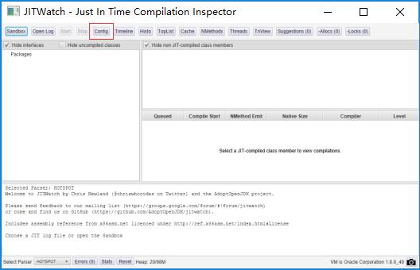
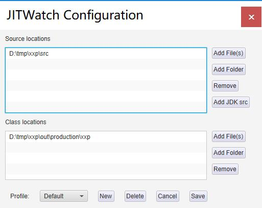
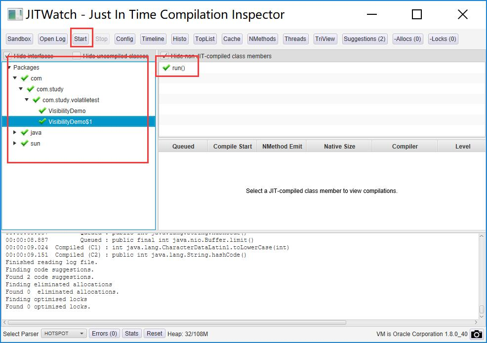
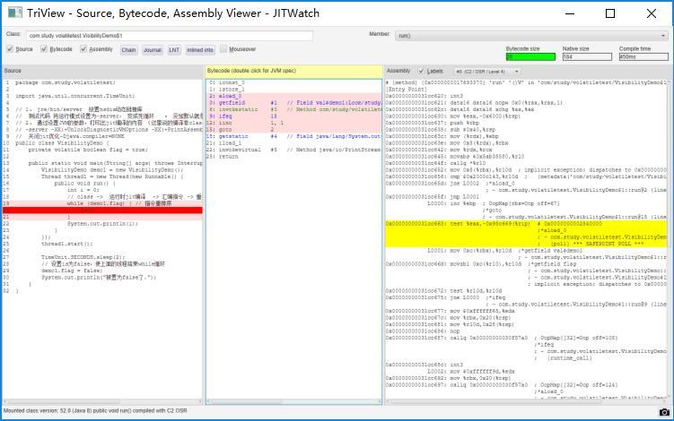
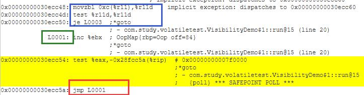

> 转载  <https://github.com/xuqifzz>

# 线程安全之可见性问题

本节老师主要是进行概念讲解,讲述了一些底层优化原理导致的诡异现象,以及在Java层面应对的方案.

这节课最令人兴奋的部分就是tony老师介绍的jitwatch,不仅可以从字节码层面对程序进行分析,还能在汇编层面进行更加底层的分析.

因此根据tony老师提供的资料去看看究竟是怎么回事,因为本人也没学习过汇编,所有知识都是现学现卖,若有错误,敬请指正

## 操作步骤
* 将 [hsdis-i386.dll](hsdis-i386.dll)(用于32位系统)/[hsdis-amd64.dll](hsdis-amd64.dll)(用于64位系统) 复制到你的jdk目录下的jre\bin\server目录下

* 前往[github](https://github.com/AdoptOpenJDK/jitwatch)下载zip格式的压缩包,并解压到本机任意目录

* 编译老师提供的[VisibilityDemo.java](VisibilityDemo.java)

* 使用`-server -XX:+UnlockDiagnosticVMOptions -XX:+PrintAssembly -XX:+LogCompilation -XX:LogFile=jit20190104.log` 运行刚编译好的VisibilityDemo

* 等待程序运行一段时间后中止程序运行

* 运行后可得到[jit20190104.log](jit20190104.log)

* 进入解压后的jitwatch目录,运行`mvn clean compile exec:java`或`./gradlew clean run`可以启动jitwatch

* 

* 点击Config配置好源码以及class文件路径

* 

* 点击OpenLog,选择刚生成的log文件,在点start即可启动指令分析

* 

* 等待一小会后,即可在左边树里找到VisibilityDemo$1,然后双击点右侧的run(),可以进入指令查看的界面

* 

* 指令查看界面分为三列,左边为java源码,中间为字节码,右边为汇编指令.


## 指令分析准备工作
在开始指令分析之前,我们得打开一些资料以备随时查询,包括以下两项
* [JVM指令表](https://static.xuqi.io/JVM.html) 
* [汇编指令表.pdf](汇编指令表.pdf)

## 分析字节码
首先看下java源码 [完整代码](VisibilityDemo.java)
```java
public void run() {
    int i = 0;
    while (demo1.flag) { 
        i++;
    }
    System.out.println(i);
}
```

以下是run方法的字节码,我加入了部分注释 [原始字节码](bytecode.txt)
```
 0: iconst_0        // 将0 入栈
 1: istore_1        // int i=0
 2: aload_0         // 编译器把demo1作为参数传给了run方法,这里是装载这个参数,准备被读取demo1.flag,见下面两行
 3: getfield        #1   // Field val$demo1:Lcom/study/volatiletest/VisibilityDemo;
 6: invokestatic    #3   // Method com/study/volatiletest/VisibilityDemo.access$000:(Lcom/study/volatiletest/VisibilityDemo;)Z
 9: ifeq            18   // 判断栈顶两元素是否相等,如果相等就跳到18,结束循环
                         // 栈顶两元素分别是0和 demo1.falg,这里就是while(demo1.flag)
12: iinc            1, 1 // i++
15: goto            2    // 循环体结束,跳回while判断
18: getstatic       #4   // Field java/lang/System.out:Ljava/io/PrintStream; //准备调用print
21: iload_1         
22: invokevirtual   #5   // Method java/io/PrintStream.println:(I)V
25: return   

```
通过注释可以看到,在字节码层面, 程序逻辑并未发生改变,跟java源文件描述的行为一致.

# 分析汇编指令
下面是部分汇编指令的截图分析, 如需完整版请点击[完整汇编文件](asm.txt)
* 
* 蓝框中是做了一个判断后进行条件跳转,对r11d进行一顿操作后,测试是否为0,如果是0就跳到L0003(截图里没给出,这是跳出循环了),这里应该是类似于if(demo1.flag), 显然此时demo1.flag不是0,所以继续往下执行
* 绿框L0001是个标记, 用于跳转指令的目标,后面跟的inc是个自增指令,相当执行i++
* 黄色区域有个test,我不知道这个测试是干嘛的.可能是要设置某些状态位,但下面的jmp是无条件跳转,跟状态位没关系
* 红框里的jmp L0001是个无条件跳转指令,跳转回了L0001,这就相当于`while(true) i++;`,形成了个死循环
* 所以最终这段代码应该是这个意思
```java
if(demo1.flag)
    while(true) i++;
```


# 线程安全之原子操作
本课老师介绍了JAVA中的一些奇技淫巧(UNSAFE),引出了CAS,然后接介绍了并法包中的若干个类,解释了ABA等问题.

这里面值得学习的点有很多,一时半会学不完,UNSAFE里面包含了很多底层操作对象的方法,我想这有助于帮助深刻理解JAVA的对象模型,但目前由于一些必要的知识尚未掌握,这些想法只能暂时搁置.


# JAVA锁相关
本节课老师讲了很多内容,我暂时把关注点放在对象的MarkWord上,我想编写代码跟踪MarkWord的变化情况,主要是观察锁升级的情况

想跟踪MarkWord,就只能使用Unsafe大法了,获取Unsafe的代码如下:
```java
static {
    try {
        Field field = Unsafe.class.getDeclaredField("theUnsafe");
        field.setAccessible(true);
        unsafe = (Unsafe) field.get(null);
    } catch (Exception ex) {
        ex.printStackTrace();
    }
}

```

因为我使用的是64位系统,所以MarkWord是个long值,下面是获取MarkWord的代码,showXXX部分代码只实现了一部分,有时间再慢慢更新

```java
static void showMarkWord(Object o){
    long markWord =unsafe.getLong(o,0);
    int tag = (int)getSubLong(markWord,62,2);
    switch (tag){
        case 0:showLightWeightLocked(markWord);break;
        case 1:showUnlocked(markWord);break;
        case 2:showHeavyWeightLocked(markWord);break;
        case 3:showMarkForGC(markWord);break;

    }
}

```

主测试代码逻辑如下
* 初始化一个对象后,查看其MarkWord
* 主线程进入同步块,查看其MarkWord
* 启动子线程,在子线程进入同步块查看其MarkWord
* 创造冲突,使锁升级,查看MarkWord
* 释放锁后,查看MarkWord

```java
Object o = new Object();

showMarkWord(o);
synchronized (o){
    System.out.println("===主线程同步块1 ===");
    showMarkWord(o);
}

Thread t= new Thread(()->{
    synchronized (o){
        System.out.println("===子线程同步块1 ===");
        showMarkWord(o);
    }
    sleep(1000);
    synchronized (o){
        System.out.println("===子线程同步块2 ===");
        showMarkWord(o);
    }
});
t.start();
sleep(500);
synchronized (o){
    System.out.println("===主线程同步块2开始 ===");
    showMarkWord(o);
    sleep(2000);
    System.out.println("===主线程同步块2结束 ===");
    showMarkWord(o);
}
System.gc();
sleep(3000);
System.out.println("=== 结束 ===");
showMarkWord(o);
```

示例输出,最后age变为1是因为这个对象经历了一次gc `System.gc();`
```
===初始化 ===
lock:Unlocked,biasedLock:0,age:0
===主线程同步块1 ===
lock:LightWeightLocked
===子线程同步块1 ===
lock:LightWeightLocked
===主线程同步块2开始 ===
lock:LightWeightLocked
===主线程同步块2结束 ===
lock:HeavyWeightLocked
===子线程同步块2 ===
lock:HeavyWeightLocked
=== 结束 ===
lock:Unlocked,biasedLock:0,age:1
```
从示例看,貌似并没有启用偏向锁,问题再哪,我咨询了ModraedLa同学,他指出需要加上`-XX:BiasedLockingStartupDelay=0`,因为偏向锁需要一定时间，这个参数可以取消这个延迟时间.

在[这个文档](https://wiki.openjdk.java.net/display/HotSpot/Synchronization)上有说明:

> It is enabled by default for Java 6 and Java 7, but activated only some seconds after the application startup. Therefore, beware of short-running micro-benchmarks. If necessary, turn off the delay using the flag -XX:BiasedLockingStartupDelay=0.

加上`-XX:BiasedLockingStartupDelay=0`后,输出结果如下:
```
===初始化 ===
lock:Unlocked,biasedLock:1,thread:0,epoch:0,age:0
===主线程同步块1 ===
lock:Unlocked,biasedLock:1,thread:54858,epoch:0,age:0
===子线程同步块1 ===
lock:LightWeightLocked
===主线程同步块2开始 ===
lock:LightWeightLocked
===主线程同步块2结束 ===
lock:HeavyWeightLocked
===子线程同步块2 ===
lock:HeavyWeightLocked
=== 结束 ===
lock:Unlocked,biasedLock:0,age:1
```
从上面的输出可以看到从可偏向->偏向锁定->轻量级锁->重量级锁->解锁 的全过程
[完整代码:MarkWord.java](MarkWord.java)


