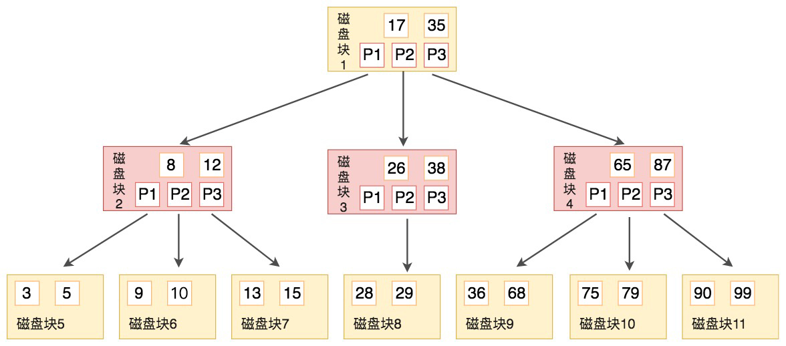
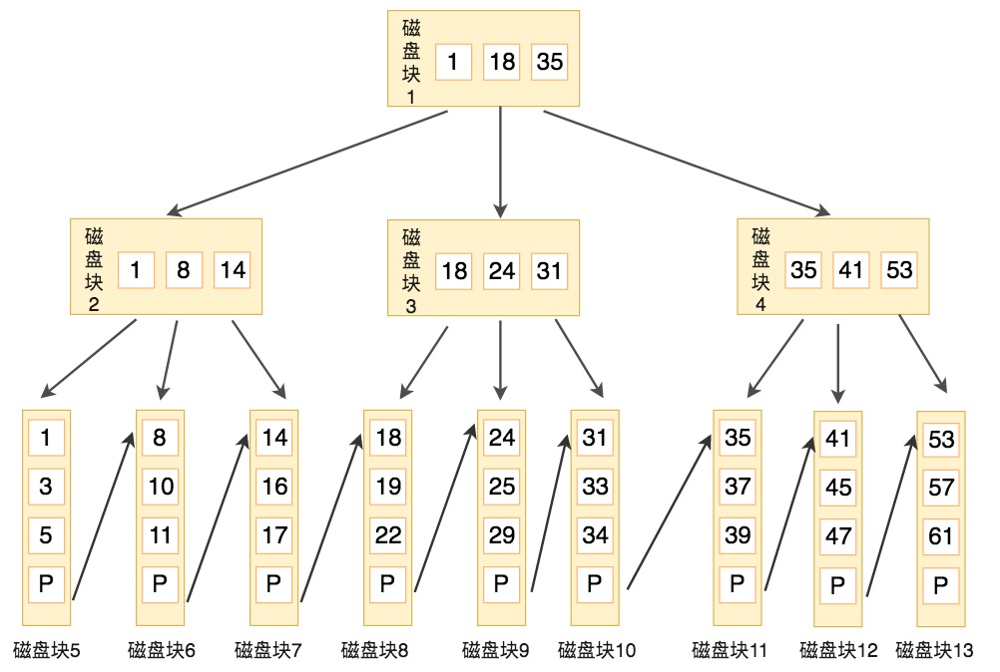
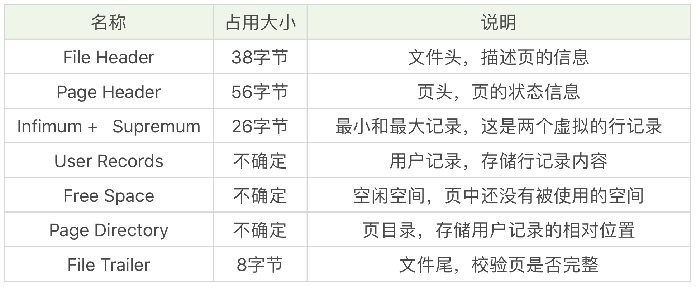
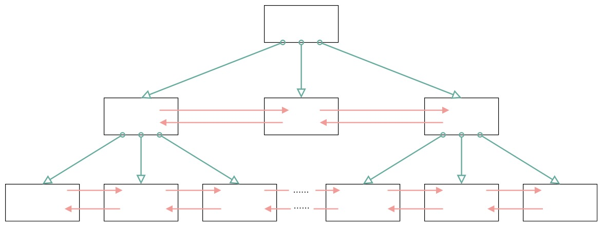
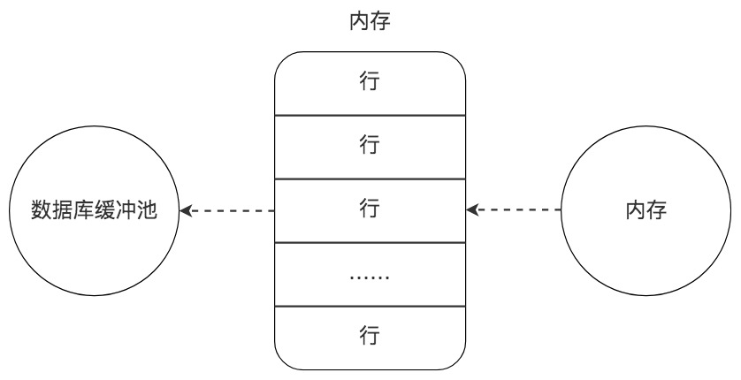
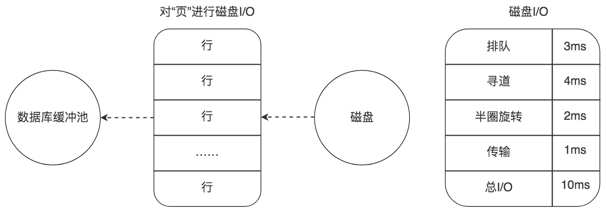
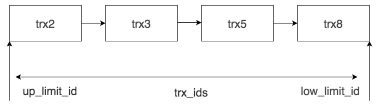

# SQL必知必会

> 极客时间内陈旸老师的《SQL必知必会》学习笔记
>
> https://time.geekbang.org/column/intro/192

# Select 的执行顺序


```sql
SELECT ... FROM ... WHERE ... GROUP BY ... HAVING ... ORDER BY ...
```

```sql
FROM > WHERE > GROUP BY > HAVING > SELECT 的字段 > DISTINCT > ORDER BY > LIMIT
```

# IN 和 EXISTS

```sql
Select * FROM A WHERE cc in (Select cc FROM B)

Select * FROM A WHERE EXISTS (Select cc FROM B where B.cc = A.cc)
```

在对cc列建立索引的情况下，<br>
表A > 表B, `IN` 子查询的效率高，因为采用的是表B的索引。<br>
表A < 表B,`EXISTS` 子查询的效率高。

## 总结
当查询字段进行了索引时，主表A 大于从表B，使用 IN 子查询的效率高，相反主表A 小于 从表A时，使用 EXISTS 子查询的效率高。


# 索引的概览

## 什么情况下创建索引，什么时候不需要索引？

**索引**就是帮助数据库管理系统高效获取数据的数据结构。

**索引不是万能的，在有些情况下使用索引反而会让效率变低。**

1. 在数据表中的数据行数比较少的情况下，比如不到 1000 行，是不需要创建索引的。
2. 当数据重复度大，比如高于 10% 的时候，也不需要对这个字段使用索引。

## 索引的种类有哪些？

从功能逻辑上说，索引主要有 4 种，分别是**普通索引**、**唯一索引**、**主键索引**和**全文索引**。

按照物理实现方式，索引可以分为 2 种：**聚集索引**和**非聚集索引**。我们也把非聚集索引称为二级索引或者辅助索引。

**聚集索引**可以按照主键来排序存储数据，这样在查找行的时候非常有效。举个例子，如果是一本汉语字典，我们想要查找“数”这个字，直接在书中找汉语拼音的位置即可，也就是拼音“shu”。这样找到了索引的位置，在它后面就是我们想要找的数据行。

非聚集索引又是什么呢？

在数据库系统会有单独的存储空间存放非聚集索引，这些索引项是按照顺序存储的，但索引项指向的内容是随机存储的。也就是说系统会进行两次查找，**第一次先找到索引，第二次找到索引对应的位置取出数据行**。非聚集索引不会把索引指向的内容像聚集索引一样直接放到索引的后面，而是维护单独的索引表（只维护索引，不维护索引指向的数据），为数据检索提供方便。我们还以汉语字典为例，如果想要查找“数”字，那么按照部首查找的方式，先找到“数”字的偏旁部首，然后这个目录会告诉我们“数”字存放到第多少页，我们再去指定的页码找这个字。

聚集索引与非聚集索引的原理不同，在使用上也有一些区别：
1. 聚集索引的叶子节点存储的就是我们的数据记录，非聚集索引的叶子节点存储的是数据位置。非聚集索引不会影响数据表的物理存储顺序。
2. 一个表只能有一个聚集索引，因为只能有一种排序存储的方式，但可以有多个非聚集索引，也就是多个索引目录提供数据检索。
3. 使用聚集索引的时候，数据的查询效率高，但如果对数据进行插入，删除，更新等操作，效率会比非聚集索引低。

除了业务逻辑和物理实现方式，索引还可以按照字段个数进行划分，分成**单一索引**和**联合索引**。

创建联合索引时，我们需要注意创建时的顺序问题，因为联合索引 (x, y, z) 和 (z, y, x) 在使用的时候效率可能会存在差别。

联合索引的**最左匹配原则**，也就是按照最左优先的方式进行索引的匹配。比如刚才举例的 (x, y, z)，如果查询条件是 WHERE x=1 AND y=2 AND z=3，就可以匹配上联合索引；如果查询条件是 WHERE y=2，就无法匹配上联合索引。

# 索引的原理

## 什么是 B 树

**B 树**的英文是 Balance Tree，也就是**平衡的多路搜索树**，它的高度远小于平衡二叉树的高度。在文件系统和数据库系统中的索引结构经常采用 B 树来实现。



B 树作为平衡的多路搜索树，它的每一个节点最多可以包括 M 个子节点，M 称为 B 树的阶。同时你能看到，每个磁盘块中包括了关键字和子节点的指针。如果一个磁盘块中包括了 x 个关键字，那么指针数就是 x+1。对于一个 100 阶的 B 树来说，如果有 3 层的话最多可以存储约 100 万的索引数据。对于大量的索引数据来说，采用 B 树的结构是非常适合的，因为树的高度要远小于二叉树的高度。

一个 M 阶的 B 树（M>2）有以下的特性：

1. 根节点的儿子数的范围是 [2,M]。
2. 每个中间节点包含 k-1 个关键字和 k 个孩子，孩子的数量 = 关键字的数量 +1，k 的取值范围为 [ceil(M/2), M]。
3. 叶子节点包括 k-1 个关键字（叶子节点没有孩子），k 的取值范围为 [ceil(M/2), M]。
4. 假设中间节点节点的关键字为：Key[1], Key[2], …, Key[k-1]，且关键字按照升序排序，即 Key[i]<Key[i+1]。此时 k-1 个关键字相当于划分了 k 个范围，也就是对应着 k 个指针，即为：P[1], P[2], …, P[k]，其中 P[1] 指向关键字小于 Key[1] 的子树，P[i] 指向关键字属于 (Key[i-1], Key[i]) 的子树，P[k] 指向关键字大于 Key[k-1] 的子树。
5. 所有叶子节点位于同一层。

上面那张图所表示的 B 树就是一棵 3 阶的 B 树。我们可以看下磁盘块 2，里面的关键字为（8，12），它有 3 个孩子 (3，5)，(9，10) 和 (13，15)，你能看到 (3，5) 小于 8，(9，10) 在 8 和 12 之间，而 (13，15) 大于 12，刚好符合刚才我们给出的特征。

## 什么是 B+ 树

**B+ 树**基于 B 树做出了改进，主流的 DBMS 都支持 B+ 树的索引方式，比如 MySQL。B+ 树和 B 树的差异在于以下几点：
1. 有 k 个孩子的节点就有 k 个关键字。也就是孩子数量 = 关键字数，而 B 树中，孩子数量 = 关键字数 +1。
2. 非叶子节点的关键字也会同时存在在子节点中，并且是在子节点中所有关键字的最大（或最小）。
3. 非叶子节点仅用于索引，不保存数据记录，跟记录有关的信息都放在叶子节点中。而 B 树中，非叶子节点既保存索引，也保存数据记录。
4. 所有关键字都在叶子节点出现，叶子节点构成一个有序链表，而且叶子节点本身按照关键字的大小从小到大顺序链接。

下图就是一棵 B+ 树，阶数为 3，根节点中的关键字 1、18、35 分别是子节点（1，8，14），（18，24，31）和（35，41，53）中的最小值。每一层父节点的关键字都会出现在下一层的子节点的关键字中，因此在叶子节点中包括了所有的关键字信息，并且每一个叶子节点都有一个指向下一个节点的指针，这样就形成了一个链表。




# 索引的使用原则

## 创建索引的规律

1. 字段的数值有唯一性的限制，比如用户名
2. 频繁作为 `WHERE` 查询条件的字段，尤其在数据表大的情况下
3. 需要经常 `GROUP BY` 和 `ORDER BY` 的列
4. `UPDATE`、`DELETE` 的 `WHERE` 条件列，一般也需要创建索引
5. `DISTINCT` 字段需要创建索引
6. 做多表  `JOIN` 连接操作时，创建索引时连接表尽量不要超过3张，对`WHERRE`条件创建索引

## 索引失效的情况

1. 如果索引进行了表达式计算，则会失效
2. 如果对索引使用函数，也会造成失效
3. 在 `WHERE` 子句中，如果在 `OR` 前的条件列进行了索引，而在 `OR` 后的条件列没有进行索引，那么索引会失效。
4. 当我们使用 `LIKE` 进行模糊查询的时候，后面不能是 %
5. 索引列与 `NULL` 或者 `NOT NULL` 进行判断的时候也会失效。
6. 我们在使用联合索引的时候要注意最左原则

# 从数据页的角度理解 B+ 树查询

## 数据库中存储结构是怎么样的

记录是按照行来存储的，但是数据库的读取并不是以行为单位，否则一次读取（一个I/O操作）只能处理一行数据，效率会非常当地。因此**在数据库中，不论读一行，还是读多行，都是将这些行所在的页进行加载。也就是说，数据库管理存储空间的基本单位是页（Page）**。

一个页中可以存储多个行记录（`ROW`），同时在数据库中，还存在着区（`Extent`）、段（`Segment`）和表空间（`Tablespace`）。行、页、区、段、表空间的关系如下图：


区（`Extent`）是比页大一级的存储结构，在`InnoDB` 引擎中，一个区会分配64个连续的页。因为 `InnoDB`中的页大小默认是`16KB`，所以一个区的大小是 `64*16KB=1M`。

段（`Segment`）由一个或多个区组成，区在文件系统是一个连续分配的空间（在`InnoDB` 中是连续的64页），不过在段中不要求区与区之间是相邻的。段是数据库中的分配单位，不同类型的数据库对象以不同的段形式存在。当我们创建数据表、索引的时候，就会相应创建对应的段，比如创建一张表时会创建一个表段，创建一个索引时会创建一个索引段。

表空间（`Tablespace`）是一个逻辑容器，表空间存储的对象是段，在一个表空间中可以有一个或多个段，但是一个段只能属于一个表空间。数据库由一个或多个表空间组成，表空间从管理上可以划分为系统表空间、用户表空间、撤销表空间、临时表空间等。

在`InnoDB`中存在两种表空间类型：共享表空间和独立表空间。

共享表空间：多张表共用一个表空间。

独立表空间：一张表对应一个表白空间，也就是数据和索引信息都会保存在自己的表空间中。

独立的表空间可以在不同的数据库之间进行迁移。

## 数据页内的结构是怎么样的

页（`Page`）按照类型划分的话，常见的有 数据页（保存B+树节点）、系统页、Undo页和事务数据页等。数据页是最常使用的页。

页的结构如图：


作用：



7个部分可以分成3个部分：

1. 文件通用部分
2. 记录部分
3. 索引部分

## 从数据页的角度看 B+ 树是如何进行查询的

MySQL 的 InnoDB 存储引擎采用 B+ 树作为索引，而索引又可以分成聚集索引和非聚集索引（二级索引），这些索引都相当于一棵 B+ 树，如图所示。一棵 B+ 树按照节点类型可以分成两部分：

1. 叶子节点，B+ 树最底层的节点，节点的高度为 0，存储行记录。
2. 非叶子节点，节点的高度大于 0，存储索引键和页面指针，并不存储行记录本身。




在一棵 B+ 树中，每个节点都是一个页，每次新建节点的时候，就会申请一个页空间。同一层上的节点之间，通过页的结构构成一个双向的链表（页文件头中的两个指针字段）。非叶子节点，包括了多个索引行，每个索引行里存储索引键和指向下一层页面的页面指针。最后是叶子节点，它存储了关键字和行记录，在节点内部（也就是页结构的内部）记录之间是一个单向的链表，但是对记录进行查找，则可以通过页目录采用二分查找的方式来进行。


# 从磁盘I/O的角度理解SQL查询的成功

## 数据库缓存池

> TODO

## 数据页加载的三种方式

### 内存读取



### 随机读取



### 顺序读取

顺序读取其实是一种批量读取的方式，因为我们请求的数据在磁盘上往往都是相邻存储的，顺序读取可以帮我们批量读取页面，这样的话，一次性加载到缓冲池中就不需要再对其他页面单独进行磁盘 I/O 操作了。如果一个磁盘的吞吐量是 40MB/S，那么对于一个 16KB 大小的页来说，一次可以顺序读取 2560（40MB/16KB）个页，相当于一个页的读取时间为 0.4ms。采用批量读取的方式，即使是从磁盘上进行读取，效率也比从内存中只单独读取一个页的效率要高。

> 顺序读的页面平均加载效率更高是因为顺序读更贴合存储介质的物理特性，即一次顺序读取一批相邻物理块的效率，大于多次随机访问不连续的物理块的效率。


# 为什么没有理想的索引

## 索引片和过滤因子

索引片就是 SQL 查询语句在执行中需要扫描的一个索引片段，我们会根据索引片中包含的匹配列的数量不同，将索引分成窄索引（比如包含索引列数为 1 或 2）和宽索引（包含的索引列数大于 2）。

如果索引片越宽，那么需要顺序扫描的索引页就越多；如果索引片越窄，就会减少索引访问的开销。

```sql
SELECT comment_id, product_id, comment_text, user_id FROM product_comment WHERE user_id between 100001 and 100100
```

针对这条 SQL 查询语句，我们可以设置窄索引（user_id）。需要说明的是，每个非聚集索引保存的数据都会存储主键值，然后通过主键值，来回表查找相应的数据，因此每个索引都相当于包括了主键，也就是`(comment_id, user_id)`。

同样我们可以设置宽索引<code>（user_id, product_id, comment_text）</code>，相当于包括了主键，也就是<code>（comment_id, user_id, product_id, comment_text）</code>。

### 如何通过宽索引避免回表

#### 回表

回表指的就是数据库根据索引找到了数据行之后，还需要通过主键再次到数据表中读取数据的情况。

## 三星索引

1. 在 WHERE 条件语句中，找到所有等值谓词中的条件列，将它们作为索引片中的开始列；
2. 将 GROUP BY 和 ORDER BY 中的列加入到索引中；
3. 将 SELECT 字段中剩余的列加入到索引片中。

但就同三范式一样，很多时候我们并没有遵循三范式的设计原则，而是采用了反范式设计。同样，有时候我们并不能需要完全遵循三星索引的原则，原因主要有以下两点：

1. 采用三星索引会让索引片变宽，这样每个页能够存储的索引数据就会变少，从而增加了页加载的数量。从另一个角度来看，如果数据量很大，比如有 1000 万行数据，过多索引所需要的磁盘空间可能会成为一个问题，对缓冲池所需空间的压力也会增加。
2. 增加了索引维护的成本。如果我们为所有的查询语句都设计理想的三星索引，就会让数据表中的索引个数过多，这样索引维护的成本也会增加。举个例子，当我们添加一条记录的时候，就需要在每一个索引上都添加相应的行（存储对应的主键值），假设添加一行记录的时间成本是 10ms（磁盘随机读取一个页的时间），那么如果我们创建了 10 个索引，添加一条记录的时间就可能变成 0.1s，如果是添加 10 条记录呢？就会花费近 1s 的时间。从索引维护的成本来看消耗还是很高的。当然对于数据库来说，数据的更新不一定马上回写到磁盘上，但即使不及时将脏页进行回写，也会造成缓冲池中的空间占用过多，脏页过多的情况。

# 锁：悲观锁、乐观锁

## 按照锁粒度进行划分

1. 行锁
2. 页锁
3. 表锁

## 从数据库管理的角度进行划分

1. 共享锁（S锁）
2. 排他锁（X锁）

*意向锁（Intent Lock），简单来说就是给更大一级别的空间示意里面是否已经上过锁。*

>  如果事务想要获得数据表中某些记录的共享锁，就需要在数据表上添加意向共享锁。同理，事务想要获得数据表中某些记录的排他锁，就需要在数据表上添加意向排他锁。这时，意向锁会告诉其他事务已经有人锁定了表中的某些记录，不能对整个表进行全表扫描。

## 从程序园的角度进行划分

1. 乐观锁
2. 悲观锁

### 乐观锁

#### 版本号机制

```sql
update set version=version+1 where version=#{version}
```


# 通过 MVCC 机制解决不可重复读和幻读问题

## MVCC

Multiversion Concurrency Control ，中文翻译为 多版本并发控制技术。

## Read View

在 MVCC 机制中，多个事务对同一个行记录进行更新会产生多个历史快照，这些历史快照保存在 Undo Log里。如果一个事务想要查询这个行记录，需要读取哪个版本的行记录呢？这时就需要用到 Read VIew了，它帮我们解决了行的可见性问题。

Read View保存了当前事务开启时所有活跃（还没有提交）的事务列表， Read View保存了不应该让这个事务看到的其他的事务ID列表。

在 Read View 中有几个重要的属性：

1. trx_ids，系统当前正在活跃的事务ID集合
2. low_limit_id，活跃的事务中最大的事务ID
3. up_limit_id，活跃的事务中最小的事务ID
4. creator_trx_id，创建这个 Read View 的事务ID

如图所示， trx_ids为 trx2、trx3、trx5、trx8的集合，活跃的最大事务ID=trx8，活跃的最小的事务ID= trx2。




假设当前有事务 creator_trx_id想要读取取个行记录，这个行记录的事务ID为 trx_id,那么会出现的情况有：

1. 如果 trx_id < 最小的事务ID（up_limit_id）,也就是说这个行记录在这些活跃的事务创建之前就已经提交了，那么这个行记录对该事务是可见的。
2. 如果trx_id > 最大的事务ID，说明该行记录在这个活跃的事务创建之后才创建，那么这个行记录对当前事务不可见。
3. 如果 最小 < trx_id < 最大，说明该行记录所在的事务 trx_id 在目前 creator_trx_id这个事务创建的时候，可能还处于活跃的状态，因此需要在 trx_ids中进行遍历，如果 trx_id 存在于 trx_ids中，说明这个事务trx_id还处于活跃状态，不可见。否则，如果 trx_id不存在于 trx_ids，证明 trx_id已经提交了，该行记录可见。

## InnoDB 如何解决幻读

InnoDB三种行锁的方式：

1. 记录锁：针对单个行记录添加锁
2. 间隙锁：锁定一个范围，但不包括记录本事，采用间隙锁的方式可以防止幻读情况的产生
3. Next-Key锁：锁定一个范围，同时锁定记录本身，相当于间隙锁+记录锁，可以解决幻读的问题。

# 查询优化器

## RBO

Rule-Based Optimizer，基于规则的优化器,规则就是人们以往的经验，或者是采用已经被证明是有效的方式。

## CBO

Cost-Based Optimizer，基于代价的优化器，这里会根据代价评估模型，计算每条可能的执行计划的代价，从中选择代价最小的作为执行计划。

## 特点

RBO，基于规则，每条sql经过RBO优化出来的结果都是固定的。

CBO，基于代价，根据统计信息，配置参数，优化器参数，sql经过优化出来的结果不是固定的，类似利用统计学得到最佳的优化结果。

CBO比较复杂，任何一个参数没有调好，可能优化结果都不理想，还有统计信息的准确度，如果要很高的准确度，那么维护准确度的代价也是很大的。

