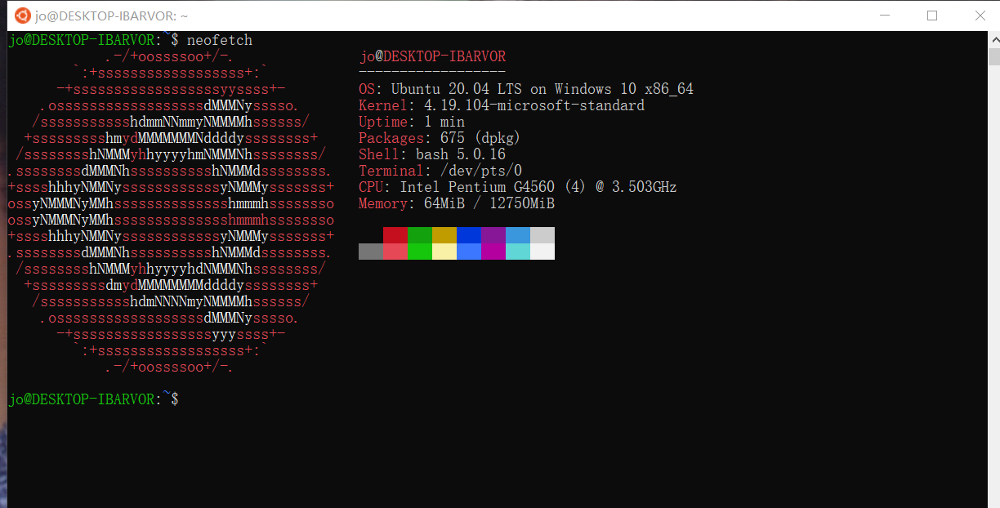
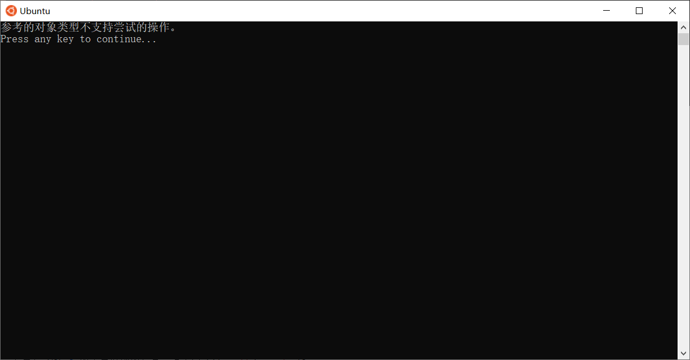

# Windows 10 开启 WSL2

按照 Microsoft的[Doc](https://docs.microsoft.com/zh-cn/windows/wsl/install-win10)安装Windows子系统时遇到的一些问题以及解决办法的记录。

> 最强的Linux发行版，Microsoft Windows 10. 
>
> Microsoft YES！



## 问题

### 将 WSL 2 设置为默认版本

> 安装内核后，请再次运行该命令，该命令应会成功完成而不显示消息。

具体现象：在执行了

```powershell
wsl --set-default-version 2
```

之后出现了提示信息，还以为没有安装成功。

```powershell
PS C:\Users\intel> wsl --set-default-version 2
有关与 WSL 2 的主要区别的信息，请访问 https://aka.ms/wsl2
```

### 设置新分发版

在安装完成Ubuntu之后，终端打开体出现：

```powershell
Installing, this may take a few minutes...
WslRegisterDistribution failed with error: 0xc03a001a
Error: 0xc03a001a ???????????????????????????????????????????????????
```

解决方案：

1. 在文件管理地址中输入 `%appdata%` ，会进入个人的`Roaming`文件夹中，返回上一级的 `Appdata` 文件夹，进入到 `Local/Packages` 文件夹中 
2. 在搜索栏内查找 `ubuntu`关键字，在查询的结果文件上右键属性 -> 高级 -> 取消压缩内容以便节省磁盘空间选择 -> 确定

操作之后就可以正常按照官方文档进行后续操作了。

> 注：在官方的issue中找到的解决办法，[地址](https://github.com/microsoft/WSL/issues/5325)

### 参考的对象类型不支持尝试的操作

启动Ubuntu时提示：



解决方案：

```powershell
netsh winsock reset
```

> issue地址：[4194](https://github.com/microsoft/WSL/issues/4194)


## 最强的Linux发行版 - Microsoft Windows 10

**gopher**

在Windows下使用 `Makefile` 需要花很大的功夫装环境，而有了子系统之后，可以选择在Windows下 code，编写好 `Makefile` 之后，在 `Ubuntu` 中可以很方便地进行编译。

**WSL 2**升级了子系统的网络，使得可以在子系统中使用 `micro` 进行开发，关于 `micro`，可以参考[github](https://github.com/micro/micro)。

如果是在此前的 WSL 1中使用 `micro` 的话，在执行

```shell
micro server
```

会遇到无法正常注册的日志

```shell
Server register error: Failed to join multicast group on all interfaces!
```

具体的问题描述见 [issue](https://github.com/micro/micro/issues/902)

**WSL 2**还可以使用 `docker`