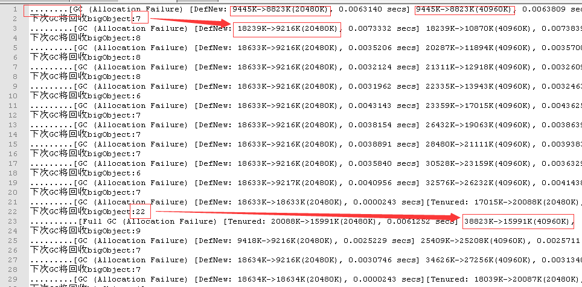
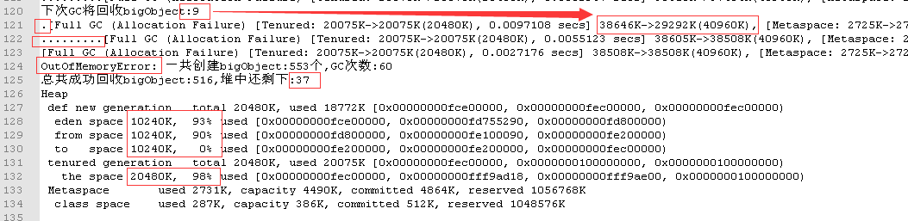

> 转载 <https://github.com/xuqifzz>

输出JVM相关配置
`java -XX:+PrintFlagsFinal`

# 使用`PhantomReference`以及GC日志分析GC如何工作

写一段程序, 每隔很短的间隔创建一个大对象, 并按照一定的规则hold住或者丢弃这个对象, 直到抛出OutOfMemoryError, 在此过程中观察GC的工作日志。

## 参数设定
从1开始递增计数, 每隔30毫秒创建一个大小为1M的bigObject对象,

如果当前计数4的倍数, 则hold住这个对象,将其放入到一个hold队列中, 不让GC将其释放,否则直接丢弃该对象

如果当前计数为5的倍数, 则从hold队列中丢弃一个对象

通过以上规则, hold队列中对象释放的速度没有增加的速度快, 因此OutOfMemoryError是必然结局


## 观察方法
Java生成的GC日志只会记录GC发生前后新生代和老年代的空间变化情况, 而我想进一步知道每次GC都释放了多少个bigObjec对象,所以这里会采用PhantomReference来跟踪bigObjec的释放情况


## 主要代码

[完整代码在这里](MyGcTest.java)

``` java
long i = 1;
try {
	for (; ; i++) {
		byte[] bigObject = new byte[Unit];//本程序的GC基本上都是由本行代码触发
		register(bigObject);	  //使用PhantomReference跟踪bigObject的释放情况,并调用checkGC()
		if (i % 4 == 0) holder.add(bigObject);		
		if (i %5 == 0) holder.poll();
		Thread.sleep(30);
	}

} catch (OutOfMemoryError error) {
	System.out.println("OutOfMemoryError: 一共创建bigObject:" + (i-1) + "个,GC次数:" + gcCount);
	System.out.println("总共成功回收bigObject:" + gcObjectCount + ",堆中还剩下:" + phantomSet.size());
}
```


## 检测一次GC回收了多少个对象代码
```java
static void register(byte[] bigObject){
    System.out.print(".");  //打一个点表示成功创建一个bigObject
	phantomSet.add(new PhantomReference<>(bigObject,phantomReferenceQueue));
	checkGC();
    System.out.print(".");  //打一个点表示成功创建一个bigObject
}

static void checkGC(){
	int count = 0;
	Reference<?> reference = null;
	while ((reference = phantomReferenceQueue.poll()) != null) {
		count++;
		phantomSet.remove(reference);
	}

	if(count > 0){
		System.out.println("下次GC将回收bigObject:" + count );
		gcCount++;
		gcObjectCount += count;

	}

}
```

## JVM参数

为了简化分析流程, 这里使用的是垃圾收集器是UseSerialGC

运行的命令行如下:

java -Xms50M -Xmx50M -Xmn30M -XX:SurvivorRatio=1 -XX:+UseSerialGC -XX:+PrintGCDetails MyGcTest > myLog.txt

这里设置堆大小为50M, 其中新生代占了30M, 老年代占了20M

新生代的中的S0,S1以及Eden按1:1:1分配空间, 各占10M, 因为同一时间内S0和S1只有一个可用,所以新生代的可用空间是20M

最后的 > myLog.txt表示将 Java生成的GC日志和代码内用System.out.println生成的日志一并记到myLog.txt中.


## 新生代和老年代的垃圾回收分析

[完整日志在这里](myLog.txt)

日志的最开始几行输出如下:




从第1行可以看到 在创建了8个bigObject对象(有8个点)后 eden就撑不住了, 触发了一次GC

但从这一行可以看到, GC并没什么效果, 只释放了少量内存, 这是因为bigObject都还被PhantomReference引用着,这次GC只是标记出哪些bigObject能被回收掉

在第2行可以看到, 上次GC标记出了7个bigObject可以被释放, 于是在第3行的GC中, 这7个对象被释放, 吐出了7M多内存

从第3行可以看到, 这一次GC由于S1区放不下S0和eden区存活的对象, 所以把一些对象放到了老年代

从第4行开始, 基本上都是创建9个bigObject后就会引发一次GC, 然后释放部分内存,由于S区装不下, 每次都会塞一两个对象去老年代

随着hold的对象越来越多, 释放的对象越来越少

直到第21行, JVM发现堆快满了, 这导致在23行处执行了一次fullGC, 干掉了老年代中本该早就释放的对象


## 最终结果
正如预料的一样, 最终结果是OutOfMemoryError




从上图中的第125行可以看到, 堆中剩下的37个bigObject让JVM缴械投降, 抛出了OutOfMemoryError,在128行到132行可以看到程序最终堆的内存使用情况, 可用的40M空间基本被占满


最后再来分析一下JVM的最后挣扎过程: 

从120行的日志可以看到, 上次GC标记出9个对象可以回收, 让121行的GC一下子回收了大量内存, 得以多喘息一阵, 

但121行这次FullGC来得太急, 距离上次GC只创建了一个 bigObject(121行前只有一个点), 所以这次回收后, 没有标记到任何bigObject, 所以下次GC无法回收到任何一个bigObject

正如123行所示, 这次GC没有回收到任何内存, 于是就抛出OutOfMemoryError了


## 本案例结论
1 使用PhantomReference跟踪对象回收, 需要GC两次才能彻底回收对象占用的内存

2 对象优先选择存放在 eden区, eden区快满了会进行一次新生代的垃圾回收

3 新生代的垃圾回收采用复制算法, 如果目标区放不下了, 直接放到老年代去

4 老年代快满(或满足指定条件)的时候会执行FullGC

5 当执行FullGC后, 仍然无法分配出用户所需要的内存后, 抛出OutOfMemoryError

