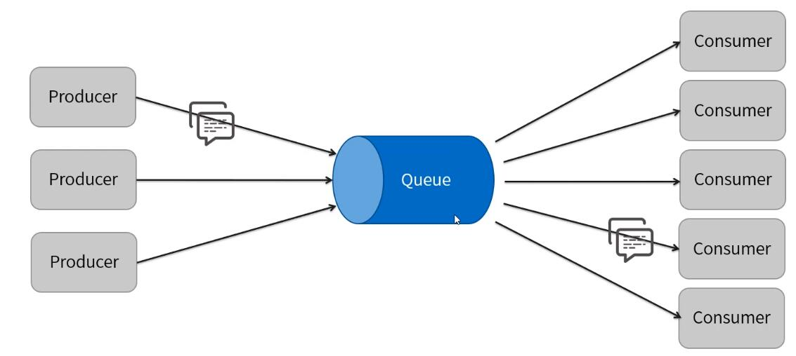
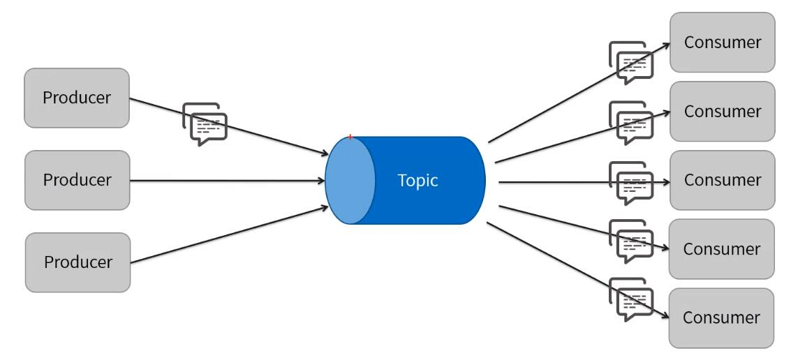

> 转载 <https://github.com/xuqifzz>

# 腾讯云Activemq启动报错的问题

在腾讯云上启动Activemq,启动报错, 错误信息是
```
java.net.URISyntaxException: Illegal character in hostname at index 7: ws://VM_0_15_centos:61614?maximumConnections=1000&wireFormat.maxFrameSize=104857600
```

初步判断是ws协议设置的问题
activemq.xml中ws协议的默认配置如下:
```xml
 <transportConnector name="ws" uri="ws://0.0.0.0:61614?maximumConnections=1000&amp;wireFormat.maxFrameSize=104857600"/>
```
尝试将以上的配置注释后, activemq就可以启动了, 看来确实是ws的问题

腾讯云的默认主机名包含下划线(VM_0_15_centos),我估计应该是这个原因, 于是尝试将主机名改为tencent(只需要修改`/etc/hostname`以及在`/etc/hosts`中加入一行名称解析即可)

修改完毕后reboot, Activemq即可成功启动。


# amq入门

## 课程目录
* ActiveMQ是什么
* JMS规范
* ActiveMQ的特性
* ActiveMQ如何安装
* ActiveMQ如何使用

## ActiveMQ是什么

ActiveMQ是Apache出品，最流行的，能力强劲的开源消息总线。

ActiveMQ是一个完全支持JMSI·1和J2EE1·4规范的JMSProvider实现，尽管JMS规范出台已经是很久的事情了，但是JMS在当今的J2EE应用中间仍然扮演着特殊的地位。

## JMS规范
Java消息服务(JavaMessageService,即JMS)应用程序接囗是一个Java平台中关于面向消息中间件(MOM)的API,用于在两个应用程序之间，或分布式系统中发送消息，进行异步通信。Java消息服务是一个与具体平台无关的API。

### JMS对象模型

| 术语 | 翻译 |
| ------ | ------ |
| ConnectionFactory | 连接工厂 |
| Connection | 连接  |
| Session | 会话  |
| Destinatlon | 目的  |
| MessageProducer | 生产者  |
| MessageConsumer | 消费者  |
| Message | 消息  |
| Broker | 消息中间件的实例(ActiveMQ)  |


### JMS消息模型
* Point-to-Point(P2P)/点对点



* Publish/Subscribe(Pub/Sub)/主题（发布订阅）



### JMS的消息结构
#### 消息头

| 消息头 | 翻译 |
| ------ | ------ |
| JMSDestination | 消息的目的地，Topic或者是Queue |
| JMSDeliveryMode | 消息的发送模式 |
| JMSTimestamp | 消息传递给Broker的时间戳，它不是实际发送的时间 |
| JMSExpiration | 消息的有效期，在有效期内，消息消费者才可以消费这个消息 |
| JMSPriority | 消息的优先级。0-4为正常的优先级，5-9为高优先级 |
| JMSMessagelD | 一个字符串用来唯一标示一个消息 |
| JMSRepIyTo | 有时消息生产者希望消费者回复一个消息，JMSReplyTo为一个Destination，表示需要回复的目的地 |
| JMSCorrelationlD | 通常用来关联多个Message |
| JMSType | 表示消息体的结构，和JMS提供者有关 |
| JMSRedelivered | 如果这个值为true，表示消息是被重新发送了 |

#### 消息属性
消息属性可以理解为消息的附加消息头，属性名可以自定义

属性值类型:

* boolean 
* byte 
* int 
* long 
* float 
* double 
* String 

#### 消息体

| 消息体类型 | 翻译 |
| ------ | ------ |
| BytesMessage | 用来传递字节消息 |
| MapMessage | 用来传递键值对消息 |
| ObjectMessage | 用来传递序列化对象 |
| StreamMessage | 用来传洋文件等 |
| TextMessage | 用来传递字符串 |


## ActiveMQ的特性

* 支持多种编程语言
* 支持多种传输协议
* 有多种持久化方式

## ActiveMQ如何安装
请参考: [activemq入门安装](https://static.xuqi.io/163/activemq_setup_md.html)

## ActiveMQ如何使用

* ActiveMQ自带有管理平台，在浏览器访问http：//服务甲：81的/admin即可进入。
* 默认账号密码都是admin
* Web控制台配置文件:conf目录下的jetty-realm.properties和jetty.xml

# amq支持的消息协议讲解
## 课程目录

* ActiveMQ支持哪些协议
* 数据传输方式
* OpenWlre协议
* MQTT协议
* AUTO协议

## ActiveMQ支持哪些协议

* ActiveMQ支持多种协议传输和传输方式，允许客户端使用多种协议连接。
* ActiveMQ支持的协议：AUTO、OpenWire、AMQP、Stomp、MQTT等。
* ActiveMQ支持的基础传输方式：VM、TCP、SSL、UDP、Peer、MulticastsHTTP(S)等，以及更高级的FailoversFanoutxDiscovery、ZeroConf方式。

### ActiveMQ的协议连接配置

位于conf/activemq.xml配置文件`<transportConnectors>`一节

```xml
<transportConnectors>
    <!-- DOS protection, limit concurrent connections to 1000 and frame size to 100MB -->
    <transportConnector name="openwire" uri="tcp://0.0.0.0:61616?maximumConnections=1000&amp;wireFormat.maxFrameSize=104857600"/>
    <transportConnector name="amqp" uri="amqp://0.0.0.0:5672?maximumConnections=1000&amp;wireFormat.maxFrameSize=104857600"/>
    <transportConnector name="stomp" uri="stomp://0.0.0.0:61613?maximumConnections=1000&amp;wireFormat.maxFrameSize=104857600"/>
    <transportConnector name="mqtt" uri="mqtt://0.0.0.0:1883?maximumConnections=1000&amp;wireFormat.maxFrameSize=104857600"/>
    <transportConnector name="ws" uri="ws://0.0.0.0:61614?maximumConnections=1000&amp;wireFormat.maxFrameSize=104857600"/>
</transportConnectors>
```

### TCP配置参数说明
* 在服务器端配置时，参数要以"transport."开头
* 在客户端连接时，参数省略"transport."前缀

| 属性 | 默认值 | 描述 |
| ------ | ------ | ------ |
| backlog | 5000 | 指定传输服务器套接字等待接受的最大连接数。 |
| connectionTimeout | 30000 | 超时时间，>=1时才有超时时间（单位为毫秒）。为0表示没有超时，负值被忽略。 |
| daemon | false | 如果为true，则传输线程将以守护进程模式运行。将代理嵌入Spring容器或Web容器中时，请将此参数设置为true，以允许容器正确关闭。 |
| dynamIcManagement | false | 如果为true,则可以通过JMX管理TransportLoggero |
| ioBufferSize | 8*1024 | 协议解析使用的缓冲区的大小。（非TCP缓冲区） |
| JmxPort | 1099 | （仅在客户端有效）JMX端口 |
| keepAlive | false | 如果为true,则在Broker连接上启用TCPKeepAlive，以防止连接在TCP级别超时。这不要和InactivityMonitor使用的KeepAlivelnfo消息混淆 |
| maximumConnections | Integer.MAX_VALUE | broker允许的最大socket数量 |
| socketBufferSize | 64*1024 | 设置接受的套接字读写缓冲区的大小（以字节为单位） |
| soLinger | Integer.MlN_VALUE | 当值>一1时，设置套接字的选项soLinger；设置为一1时，将用soLinger套接字选项。 |
| soTimeout | 0 | 设置套接字的读取超时（以毫秒为单位）；值0表示没有超时 |
| soWriteTimeout | 0 | 设置套接字的写入超时（以毫秒为单位）0表示没有超时 |
| StackSize | 0 | 设置服务端后台读取线程的堆栈大小；必须以128K的倍数指定；值为0表示忽略此参数。 |
| startLoging | true | true，将传输信息TransportLogger对象写入日志。仅在trace=true的场景下生效 |
| tcpNoDeIay | false | 如果为true，则设置套接字的选项TCP_NODELAY。这会禁用Nag[e的小数据包传输算法。 |
| threadName | N/A | 指定调用transp。rt的线程名称。例如以服务器h。st命名，调试线程的时候可以看到。 |
| trace | false | 为true时，服务器记录传输发送的所有命令内容。log4j.logger.org.apache.activemq.transport.TransportLogger=DEBUG |
| trafflcClass | 0 | ip协议级别的服务质量参数。（0X02，0X04，0X08，0X10） |
| uselnactivityMonitor | true | false,则禁用InactivityMonitor,连接永远不会超时。 |
| useKeepAlive | true | true，在空闲连接上发送KeepAllvinfo消息，防止它超时。false,指定的时间内没有接收到数据，连接超时。 |

### SSL配置说明

http://activemq.apache.org/ssl-transport-reference.html

### NIO

使用Java的NIO方式对连接进行改进，因为NIO使用线程池，可以复用线程，所以可以用更少的线程维持更多的连接。如果有大量的客户端，或者性能瓶颈在网络传输上，可以考虑使用NIO的连接方式。

NIO配置格式，可配置参数和TCP相同
```
nio://hostname:port?key:value
```
NIO是OpenWire协议的传输方式，其它协议，像AMQP、MQTT、Stomp,也有NI的实现，通常在协议前缀中加"+nio”来区分。
示例：`mqtt+nio://LocaIhost:1883`

从5·15·0开始，ActiveMQ支持调整NIO的传输线程，可以设置以下属性

| 属性 | 默认值 | 描述 |
| ------ | ------ | ------ |
| org.apache.activemq.transport.nio.SelectorManager.corePoolSize | 10 | 核心线程池线程数 |
| org.apache.activemq.transport.nio.SelectorManager.maximumPoolSize | 1024 | 线程池最大线程数 |
| org.apache.activemq.transport.nio.SelectorManager.workQueueCapacity | 0 | 线程池队列容量 |
| org.apache.activemq.transport.nio.SelectorManager.rejectWork | false | 当达到容量时，允许使用IOException拒绝工作，以便可以保留现有的QOS |

NIO+SSL配置格式，可配置参数和TCP相同

`nio+ssl：//0.0.0.0:61616`

### UDP

| 属性 | 默认值 | 描述 |
| ------ | ------ | ------ |
| trace | false | 为true时，将会记录传输发送的所有命令。 |
| useLocalHost | true | 为true时，本机机器名被解析为localhost |
| datagramSize | 4*1024 | 指定数据报的大小 |

### HTTP

HTTP配置格式 `http://locaIhost:8080?param1=va11&param2=va12`
HTTPS配置格式 `https://locaIhost:8080?param1=va11&param2=va12`

### VM

配置格式 `vm://brokerName?marshal=faIse&broker.persistent=false`


## OpenWire协议

OpenWire是Apache的一种跨语言的协议，允许从不同的语言和平台访问ActiveMQ，是ActiveMQ4·x以后的版本默认的传输协议。

http://activemq.apache.org/openwire-version-2-specification.html

http://activemq.apache.org/wire-protocol.html

OpenWire支持TCP、SSL、NIO、UDP、XVM等传输方式，直接配置这些连接，就是使用的OpenWire协议，OpenWire有自己的配置参数，客户端和服务器端配置的参数名都通过前缀"wireFormat.”表示。

http://activemq.apache.org/configuring-wire-formats.html

示例：`tcp://localhost:61616?wireFormat.cacheEnabled=false&wireFormat.tightEncodingEnabled=false`

| 属性 | 默认值 | 描述 |
| ------ | ------ | ------ |
| stackTraceEnabled | true | 是否应该把已经发生并且跟踪到的堆栈异常，通过Broker发送到客户端 |
| tcpNODelayEnabled | true | socket的NoDelay参数 |
| cacheEnabled | true | 如果不断重复的值进行缓存，以便少编组（马上要进行的发送）发生 |
| tightEncodingEnabled | true | 根据CPU使用情况，自动调整传输内容大小（压缩比例） |
| prefixPacketSize | true | 在每个包被编组前（马上要被发送），每个包的大小是否应该作为前缀 |
| maxInactivityDuration | 30000 | 连接的最大空闲时间，以毫秒为单位。broker服务会根据配置关闭超时的连接。同时也可以通过心跳机制来保持连接。值<=0则禁用活动连接的监测。 |
| maxInactivityDurationInitalDelay | 10000 | 连接建立之后，多久开始进行超时检测 |
| cacheSize | 1024 | 如果能被缓存，那么这个规定了缓存的最大数量。此属性中在ActiveMQ的4．1中开始添加使用 |
| maxFrameSize | MAX_LONG | 可发送最大帧大小可以帮助防止OOM DOS攻击 |