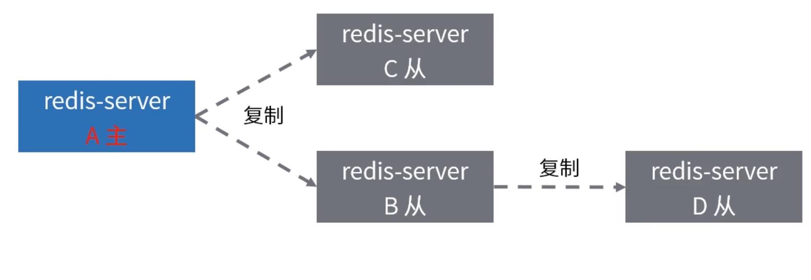
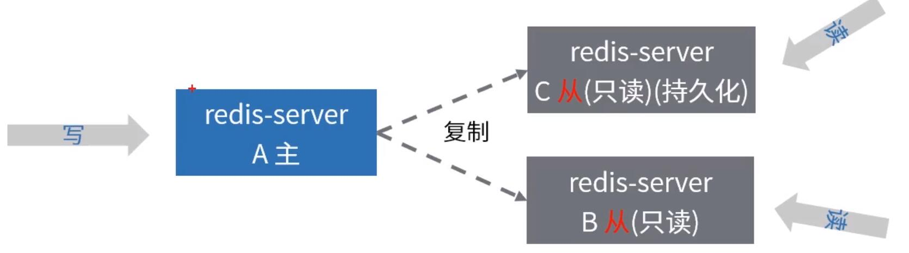
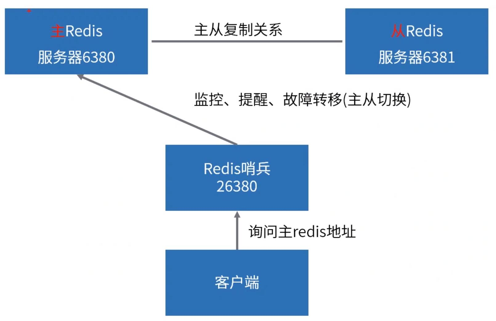
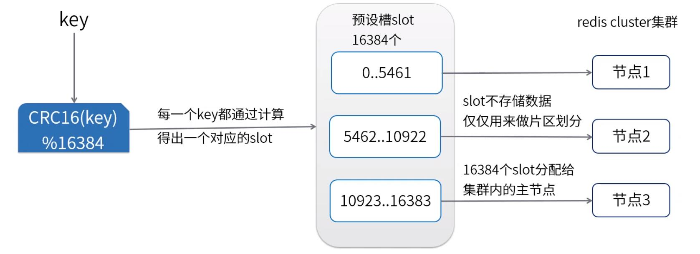

> 转载 <https://github.com/xuqifzz>

# quick usage
## single

```shell
docker run -d --name redis -p 6379:6379 -v {docker/host/volume}:/data redis redis-server --requirepass "redis123456" --appendonly yes
```

# redis数据结构和常用命令

## 本节资料
[Spring Data Redis](https://docs.spring.io/spring-data/redis/docs/2.1.5.RELEASE/reference/html)

[补充视频(Redis客户端开发)](https://study.163.com/course/courseLearn.htm?courseId=1208942829#/learn/live?lessonId=1278409623&courseId=1208942829)

[Redis配置中文说明](redis.conf)


## Redis介绍

Redis是一个开源的使用C语言编写、支持网络、可基于内存亦可持久化的日志型、Key-Value数据库，并提供多种语言的API

本质是客户端一服务端应用软件程序。特点是使用简单、性能强悍、功能应用场景丰富。

官方网站: https://redis.io

## 通命命令

| 命令 | 描述 |
| ------ | ------ |
| DEL key | 该命令用于在key存在时删除key |
| DUMP key | 序列化给定key，并返回被序列化的值 |
| EXIST Skey | 检查给定key是否存在 |
| EXPIRE key seconds | 为给定key设置过期时间，以秒计 |
| TTL key | 以秒为单位，返回给定key的剩余生存时间（TTL，time to live) |
| TYPE key | 返回key所储存的值的类型 |


## 数据结构 - String

String数据结构是简单的key-value类型，value其实不仅是String，也可以是数字。

使用场景: 微博数，粉丝数（常规计数）

| 常用命令 | 描述 |
| ------ | ------ |
| Get | 获取指定key的值 |
| Set | 设置指定key的值 |
| Incr | 将key中储存的数字值增一 |
| Decr | 将key中储存的数字值减一 |
| Mget | 获取所有（一个或多个）给定key的值 |

## 数据结构 - List

List就是链表，相信略有数据结构知识的人都应该能理解其结构。

使用场景：微博的关注列表，粉丝列表

| 常用命令 | 描述 |
| ------ | ------ |
| Lpush | 将一个或多个值插入到列表头部 |
| Rpush | 在列表中添加一个或多个值 |
| Lpop | 移出并获取列表的第一个元素 |
| Rpop | 移除列表的最后一个元素，返回值为移除的元素 |
| Lrange | 获取所有（一个或多个）给定key的值 |

## 数据结构 - Set

Set就是一个集合，集合的概念就是一堆不重复值的组合。利用Redis提供的Set数据结构，可以存储一些集合性的数据。

使用场景：实现如共同关注、共同喜好、二度好友

| 常用命令 | 描述 |
| ------ | ------ |
| Sadd | 向集合中添加一个或多个成员 |
| Spop | 移除并返回集合中的一个随机元素 |
| Smembers | 返回集合中的所有成员 |
| Sunion | 返回所有给定集合的并集 |

## 数据结构 - Sorted set

Sortedset的使用场景与set类似，区别是set不是自动有序的，而sortedset可以通过用户额外提供一个优先级（score）的参数来为成员排序，并且是插入有序的，即自动排序。

使用场景：排行榜、按照用户投票和时间排序

| 常用命令 | 描述 |
| ------ | ------ |
| Zadd | 向有序集合添加一个或多个成员，或者更新已存在成员的分数 |
| Zrange | 通过索引区间返回有序集合中指定区间内的成员 |
| Zrem | 移除有序集合中的一个或多个成员 |
| Zcard | 获取有序集合的成员数 |

## 数据结构 - Hash

Hash是一个string类型的field和value的映射表

使用场景：存储部分变更数据，如用户信息

| 常用命令 | 描述 |
| ------ | ------ |
| Hget | 获取存储在哈希表中指定字段的值 |
| Hset | 将哈希表key中的字段field的值设为value |
| Hgetall | 获取在哈希表中指定key的所有字段和值 |


## 数据结构 - Geo

GEO3.2版本开始对GEO（地理位置）的支持

使用场景：LBS应用开发


| 常用命令 | 描述 |
| ------ | ------ |
| GEOADD | 增加地理位置的坐标，可以批量添加地理位置 |
| GEODIST | 获取两个地理位置的距离 |
| GEOHASH | 获取某个地理位置的geohash值 |
| GEOPOS | 获取指定位置的坐标，可以批量获取多个地理位置的坐标 |
| GEORADIUS | 根据给定地理位置坐标获取指定范围内的地理位置集合（注意：该命令的中心点由输入的经度和纬度决定） |
| GEORADIUSBYMEMBER | 根据给定成员的位置获取指定范围内的位置信息集合（注意：该命令的中心点是由给定的位置元素决定） |

## 数据结构 - Stream

Stream5，0版本开始的新结构“流”

使用场景：消费者生产者场景（类似MQ）

| 常用命令 | 描述 |
| ------ | ------ |
| XADD | 往指定的流中添加消息 |
| XLEN | stream流中的消息数量 |
| XDEL | 删除流中的消息 |
| XRANGE | 返回流中满足给定ID范围的消息 |
| XREAD | 从一个或者多个流中读取消息 |
| XINFO | 检索关于流和关联的消费者组的不同的信息 |


# 持久化机制

## 持久化介绍
Redis的数据都存放在内存中，如果没有配置持久化，redis重启后数据就全丢失了，于是需要开启redis的持久化功能，将数据保存到磁盘上，当redis重启后，可以从磁盘中恢复数据。

## 持久化的方式
* RDB持久化
  * RDB持久化方式能够在指定的时间间隔对你的数据进行快照存储

* AOF(append only file)持久化
  * AOF持久化方式记录每次对服务器写的操作，当服务器重启的时候会重新执行这些命令来恢复原始的数据

## RDB方式
* 客户端直接通过命令BGSAVE或者SAVE来创建一个内存快照
  * BGSAVE调用fork来创建一个子进程，子进程负责将快照写入磁盘，而父进程仍然继续处理命令。
  * SAVE执行SAVE命令过程中，不再响应其他命令。

* 在redis.conf中调整save配置选项，当在规定的时间内，Redis发生了写操作的个数满足条件会触发发生BGSAVE命令

```
#900秒之内至少一次写操作
save 900 1
#300秒之内至少发生10次写操作
save 300 10
#60秒之内发生至少10000次
save 60 10000

```

## RDB优点和缺点

| 优点 | 缺点 |
| ------ | ------ |
| 对性能影响最小 | 同步时丢失数据 |
| RDB文件进行数据恢复比使用AOF要快很多 | 如果数据集非常大且CPU不够强（比如单核CPU)，Redis在fork子进程时可能会消耗相对较长的时间，影响Redis对外提供服务的能力。 |

## AOF持久化方式
* 开启AOF持久化
```
appendonly yes
```

* AOF策略调整
```
#每次有数据修改发生时都会写入AOF文件
appendfsync always

#每秒钟同步一次，该策略为AOF的缺省策略
appendfsync everysec

#从不同步。高效但是数据不会被持久化
appendfsync no
```

## AOF优点和缺点

| 优点 | 缺点 |
| ------ | ------ |
| 最安全 | 文件体积大 |
| 容灾 | 性能消耗比RDB高 |
| 易读，可修改 | 数据恢复速度比RDB慢 |


# redis内存管理


## 内存分配
不同数据类型的大小限制
* Strings类型：一个String类型的value最大可以存储512M。
* Lists类型：list的元素个数最多为2^32-1个，也就是4294967295个。
* Sets类型：元素个数最多为2^32-1个，也就是4294967295个。
* Hashset类型：键值对个数最多为2^32-1个，也就是4294967295个。

```
#最大内存控制
maxmemory 最大内存阈值
maxmemory-policy 到达阈值的执行策略
```

## 内存压缩
```
#配置字段最多512个
hash-max-zipmap-entries 512
#配置value最大为64字节
hash-max-zipmap-value 64
#配置元素个数最多512个
list-max-ziplist-entries 512
#配置value最大为64字节
list-max-ziplist-value 64

#配置元素个数最多512个
set-max-intset-entries 512
#配置元素个数最多128个
zset-max-ziplist-entries 128
#配置va山e最大为64字节
zset-max-ziplist-value 64

```

## 过期数据的处理策略
* 主动处理（redis主动触发检测key是否过期）每秒执行10次。过程如下：
  * 从具有相关过期的密钥集中测试20个随机密钥
  * 删除找到的所有密钥已过期
  * 如果超过25％的密钥已过期，请从步骤1重新开始

* 被动处理：
  * 每次访问key的时候，发现超时后被动过期，清理掉

## 数据恢复阶段过期数据的处理策略
* RDB方式
  * 过期的key不会被持久化到文件中。
  * 载入时过期的key，会通过redis的主动和被动方式清理掉。
* AOF方式
  * 当redis使用AOF方式持久化时，每次遇到过期的key redis会追加一条DEL命令到AOF文件，
  * 也就是说只要我们顺序载入执行AOF命令文件就会删除过期的键。

  注意：过期数据的计算和计算机本身的时间是有直接联系的！

## Redis内存回收策略

* 配置文件中设置：maxmemory-policy noevictlon
* 动态调整：config set maxmemory-pollcy noeviction

| 回收策略 | 说明 |
| ------ | ------ |
| noeviction | 客户端尝试执行会让更多内存被使用的命令直接报错 |
| allkeys-lru | 在所有key里执行LRU算法 |
| volatile-lru | 在所有已经过期的key里执行LRU算法 |
| volatile-lfu | 使用过期集在key中使用近似LFU进行驱逐 |
| allkeys-lfu | 使用近似LFU逐出任何键 |
| allkeys-random | 在所有key里随机回收 |
| volatile-random | 在已经过期的key里随机回收 |
| volatile-ttl | 回收已经过期的key，并且优先回收存活时间(TTL)较短的键 |

## LRU算法
LRU(Leastrecentlyused，最近最少使用）：根据数据的历史访问记录来进行淘汰数据

* 核心思想：如果数据最近被访问过，那么来被访问的几率也更高。
* 注意：Redis的LRU算法并非完整的实现，完整的LRU实现是因为这需要太多的内存。
* 方法：通过对少量keys进行取样（50％），然后回收其中一个最好的key。
* 配置方式：maxmemory-samples 5

## LFU算法
LFU(LeastFrequentlyUsed)根据数据的历史访问频率来淘汰数据

* 核心思想：如果数据过去被访问多次，那么将来被访问的频率也更高。
* Redis实现的是近似的实现，每次对key进行访问时，用基于概率的对数计数器来记录访问次数，同时这个计数器会随着时间推移而减小。
* Morriscounter算法依据：https://en.wikipedia.org/wiki/Approximate_counting_alorithm
* 启用LFU算法后，可以使用热点数据分析功能。（redis-cli-hotkeys）


# redis主从复制

## 主从复制介绍

* 什么是主从复制？


* 为什么要使用主从复制？
  * redis-server单点故障
  * 单节点QPS有限
* 主从复制应用场景分析
  * 读写分离场景，规避redis单机瓶颈
  * 故障切换，master出问题后还有s[ave节点可以使用


## 搭建主从复制

主Redis Server以普通模式启动，主要是启动从服务器的方式

* 第一种方式：命令行
```
#连接需要实现从节点的redis，执行下面的命令
slaveof [ip] [port]
```
* 第二种方式：redis.conf配置文件
```
#配置文件中增加
slaveof [ip] [port]
#从服务器是否只读（默认yes）
slave-read-only yes
```
* 退出主从集群的方式
```
Slaveof no one
```

## 检查主从复制

* master
```
127.0.0.1:6379>info replication
#Replication
#角色主
role:master
#当前从服务器数量1
Connected_slaves:1
#从服务器信息
slave0:ip:127.0.0.1,port:6380,state=online,offset=15,lag=l
#计数器，主节点复制偏移量（复制的字节数）
master_repl_offset:351
#主从同步缓存区
repl_backlog_active:l
repl_backlog_size:1048576
repl_backlog_first_byte_offset:2
repl_backlog_histlen:14

```

* slave
```
127.0.0.1:6380>info replication
#Replication
role:slave
masterhost:127.0.0.1
master_port:6379
master_link_status:up
master_last_ioseconds_ago:7
master_sync_in_progress:O
slave_repl_offset：351
#从节点优先级
slave_priority:1OO
#是否为只读节点
slave—read—only：1
connectedslaves:0
master_repl_offset:0
repl—backlog—active:0
repl—backlog—size:1048576
repl—backlog—first—byte_offset:0
repl—backlog—histlen:0

```

## 主从复制流程


* 从服务器通过psync命令发送服务器已有的同步进度（同步源ID、同步进度offset)
* master收到请求，同步源为当前master，则根据偏移量增量同步
* 同步源非当前master，则进入全量同步：master生成rdb，传输到slave，加载到slave内存

## 主从复制核心知识
* Redis默认使用异步复制，slave和master之间异步地确认处理的数据量
* 一个master可以拥有多个slave
* slave可以接受其他slave的连接。slave可以有下级sub slave
* 主从同步过程在master侧是非阻塞的
* slave初次同步需要册刂除旧数据，加载新数据，会阻塞到来的连接请求




## 主从复制应用场景

* 主从复制可以用来支持读写分离
* slave服务器设定为只读，可以用在数据安全的场景下。
* 可以使用主从复制来避免master持久化造成的开销。master关闭持久化，slave配置为不定期保存或是启用AOF（注意:重新启动的master程序将从一个空数据集开始，如果一个slave试图与它同步，那么这个slave也会被清空。）



## 主从复制的注意事项

* 读写分离场景：
  * 数据复制延时导致读到过期数据或者读不到数据（网络原因、slave阻塞）
  * 从节点故障(多个client如何迁移）
* 全量复制情况下：
  * 第一次建立主从关系或者runid不匹配会导致全量复制
  * 故障转移的时候也会出现全量复制
* 复制风暴：
  * master故障重启，如果slave节点较多，所有slave都要复制，对服务器的性能，网络的压力都有很大影响。
  * 如果一个机器部署了多个master
* 写能力有限
  * 主从复制还是只有一台master,提供的写服务能力有限
* master故障情况下：
  * 如果是master无持久化，slave开启持久化来保留数据的场景，建议不要配置redis自动重启。
  * 启动redis自动重启，master启动后，无备份数据，可能导致集群数据丢失的情况。
* 带有效期的key：
  * slave不会让key过期，而是等待master让key过期
  * 在Lua脚本执行期间，不执行任何key过期操作

# 哨兵高可用机制
## 哨兵（Sentinel）机制核心作用



## 核心运作流程

* 服务发现和健康检查流程
  1. 搭建redis主从集群
  1. 启动哨兵（客户端通过哨兵发现Redis实例信息）
  1. 哨兵通过连接master发现主从集群内的所有实例信息
  1. 哨兵监控redis实例的健康状况

* 故障切换流程
  1. 哨兵一旦发现master不能正常提供服务，则通知给其他哨兵
  1. 当一定数量的哨兵都认为master挂了
  1. 选举一个哨兵作为故障转移的执行者
  1. 执行者在slave中选取一个作为新的master
  1. 将其他slave重新设定为新master的从属

## 7大核心概念
1. 哨兵如何知道Redis主从信息（自动发现机制）
1. 什么是master主观下线
1. 什么是客观下线
1. 哨兵之间如何通信（哨兵之间的自动发现）
1. 哪个哨兵负责故障转移？（哨兵领导选举机制）
1. slave选举机制
1. 最终主从切换的过程

## 哨兵启动和配置

> 启动命令：redis-server/path/to/sentinel.conf--sentinel
>
> 配置文件启动时指定，运行过程中会自动变更，记录哨兵的监测结果

```
#配置文件在sentinel运行期间是会被动态修改的
#sentinel如果重启时，就可以根据这个配置来恢复其之前所监控的redis集群的状态
#绑定IP
bind 0.0.0.0
#默认yes，没指定密码或者指定IP的情况下，外网无法访问
protected-mode no
#哨兵的端口，客户端通过这个端口来发现redis
port 26380
#哨兵自己的IP，手动设定也可自动发现，用于与其他哨兵通信
sentinel announce-ip
#临时文件夹
dir /tmp
#sentinel监控的master的名字叫做mymaster,地址为60·205.209.1066380，两个及以上哨兵认定为死亡，才认为是真的死亡
sentinel monitor mymaster 60.205.209.106 6380 2
#发送心跳PING来确认master是否存活
#如果master在“一定时间范围”内不回应ping或者是回复了一个错误消息，那么这个sentinel会主观地（单方面地）认为这个master已经不可用了
sentinel down-after-milliseconds mymaster 1000
#如果在该时间(ms)内未能完成failover操作，则认为该failover失败
sentinel failover-timeout mymaster 3000
#指定了在执行故障转移时，最多可以有多少个从Redis实例在同步新的主实例，在从Redis实例较多的情况下这个数字越小，同步的时间越长，完成故障转移所需的时间就越长
sentinel parallel-syncs mymaster 1
```

## 哨兵如何知道Redis主从信息
哨兵配置文件中，保存着主从集群中master的信息，可以通过info命令，进行主从信息自动发现。

## 什么是主观下线（sdown）
* 主观下线:单个哨兵自以认为redis实例已经不能提供服务
* 检测机制:哨兵向redis发送ping请求，+PONG、-LOADING、-MASTERDOWN这三种情况视为正常其他回复均视为无效。
* 对应配置文件的配置项：sentinel down-after-milliseconds mymaster 1000


## 什么是客观下线（odown）
* 客观下线:一定数量值的哨兵认为master已经下线。
* 检测机制:当哨兵主观认为master下线后，则会通过SENTINEL is-master-down-by-addr命令询问其他哨兵是否认为master已经下线，如果达成共识（达到quorum个数），就会认为master节点客观下线，开始故障转移流程。
* 对应配置文件的配置项：sentinel monitor mymaster 60.205.209.106 6380 2

## 哨兵之间如何通信
* 哨兵之间的自动发现: 通过发布/订阅redis-server中的__sentinel__
* 哨兵之间通过命令进行通信: 直接发送命令
* 哨兵之间通过订阅发布进行通信: 相互订阅指定主题

## 哨兵领导选举机制
基于Raft算法实现的选举机制，流程简述如下：
1. 拉票阶段：每个哨兵节点希望自己成为领导者；
1. sentinel节点收到拉票命令后，如果没有收到或同意过其他sentinel节点的请求，就同意该sentinel节点的请求（每个sentinel只持有一个同意票数）；
1. 如果sentinel节点发现自己的票数已经超过一半的数值，那么它将成为领导者，去执行故障转移；
1. 投票结束后，如果超过failover-timeout的时间内，没进行实际的故障转移操作，则重新拉票选举。

> 注：以了解raft协议为主。https://raft.github.io/、http://thesecretlivesofdata.com/

## slave选举方案
从服务器实例中，按以下顺序依次筛选
* slave节点状态，非S_DOWN,O_DOWN，DISCONNECTED
  * 判断规则：(down-after-milliseconds*10）+milliseconds_since_master_is_in_SDOWN_state
  * SENTINEL slaves mymaster
* 优先级
  * redis.conf中的一个配置项：slave-priority值越小，优先级越高
* 数据同步情况
  * Replicationoffsetprocessed
* 最小的runid
  * runid比较方案：字典顺序，ASCII码


## 最终主从切换的过程
* 针对即将成为master的slave节点，将其撤出主从集群
> 自动执行：slaveof NO ONE

* 针对其他slave节点，使它们成为新master的从属
> 自动执行：slaveof new_master_host new_master_port

## 哨兵服务部署方案
* 两个哨兵，不建议
* 可以使用1主2从，三个哨兵
* 1主2从，网络分区下,可能出现数据不一致或丢失。Redis集群非强一致

# redis集群分片存储
## 为什么要分片存储
示例：公司用户量3千万，用户基本信息缓存到redis中，需要内存10G，如何设计Redis的缓存架构？

* 3千万用户，各种业务场景对用户信息的访问量很大。（单台redis示例的读写瓶颈凸显）
* 单redis实例管理10G内存，必然影响处理效率。
* redis的内存需求可能超过机器的最大内存。（一台机器不够用）

故此，引出分片存储的技术。

## 官方集群方案
* rediscluster是Redis的分布式集群解决方案，在3.0版本推出后有效地解决了redis分布式方面的需求
* 实现了数据在多个Redis节点之间自动分片、故障自动转移、扩容机制等功能。



## 搭建集群
* 准备6个独立的redis服务
* 通过redis一cli工具创建集群
* 检验集群
* 故障转移测试
* 集群扩容
* 集群节点删除

## 集群关心的问题
* 增加了slot槽的计算，是不是比单机性能差？
  * 共16384个槽，slots槽计算方式公开的，HASH_SLOT=CRC16(key) mod 16384
  * 为了避免每次都需要服务器计算重定向，优秀的java客户端都实现了本地计算，并且缓存服务器slots分配，有变动时再更新本地内容，从而避免了多次重定向带来的性能损耗。
* redis集群大小，到底可以装多少数据？
  * 理论是可以做到16384个槽，每个槽对应一个实例，但是redis官方建议是最大1000个实例。存储足够大了
* 集群节点间是怎么通信的？
  * 每个Redis群集节点都有一个额外的TCP囗，每个节点使用TCP连接与每个其他节点连接。检测和故障转移这些步骤基本和哨兵模式类似（毕竟是同一个软件，同一个作者设计）。
* ask和moved重定向的区别
  * 若确定slot不属于当前节点，redis会返回moved
  * 若当前redis节点正在处理slot迁移，则代表此处请求对应的key暂时不在此节点，返回ask,告诉客户端本次请求重定向。
* 数据倾斜和访问倾斜的问题:倾斜导致集群中部分节点数据多，压力大。解决方案分为前期和后期：
  * 前期是业务层面提前预测，哪些key是热点，在设计的过程中规避。
  * 后期是slot迁移，尽量将压力分摊(slot调整有自动rebalance、reshard和手动）。
* slot手动迁移怎么做？迁移过程下，大致描述如下：
  * 在迁移目的节点执行`cluster setslot <slot> IMPORTING <node ID>`命令，指明需要迁移的slot和迁移源节点。
  * 在迁移源节点执行`cluster setslot <slot> MIGRATING <nodeID>`命令，指明需要迁移的slot和迁移目的节点。
  * 在迁移源节点执行`cluster getkeysinslot`获取该slot的key列表
  * 在迁移源节点执行对每个key执行`migrate`命令，该命令会同步把该key迁移到目的节点。
  * 在迁移源节点反复执行`cluster getkeysinslot`命令，直到该slot的列表为空
  * 在迁移源节点和目的节点执行`cluster setslot  <slot> NODE <node ID>`，完成迁移操作。
* 节点之间会交换信息，传递的消息包括槽的信息，带来带宽消耗。
  * 注意:避免使用大的一个集群，可以分多个集群
* Pub/Sub发布订阅机制
  * 注意：对集群内任意的一个节点执行publish发布消息，这个消息会在集群中进行传播，其他节点接收到发布的消息
* 读写分离
  * redis-cluster默认所有从节点上的读写，都会重定向到key对接槽的主节点上
  * 可以通过readonly设置当前连接可读，通过readwrite取消当前连接的可读状态。
  * 注意主从节点依然存在数据不一致的问题


# redis监控

## Monitor命令
* monitor是一个调试命令，返回服务器处理的每个命令。对于发现程序的错误非常有用
* 出于安全考虑，某些特殊管理命令CONFIG不会记录到MONITOR输出
* 运行一个MONITOR命令能够降低50％的吞吐量，运行多个MONITOR命令降低的吞吐量更多

## Info命令
INFO命令以一种易于理解和阅读的格式，返回关于Redis服务器的各种信息和统计数值

| Info命令 | 返回信息 |
| ------ | ------ |
| server | Redis服务器的一般信息 |
| clients | 客户端的连接部分 |
| memory | 内存消耗相关信息 |
| persistence | 持久化相关信息 |
| stats | 一般统计 |
| replication | 主/从复制信息 |
| cpu | 统计CPU的消耗 |
| commandstats | Redis命令统计 |
| cluster | Redis集群信息 |
| keyspace | 数据库的相关统计 |

## redisLive
参阅老师提供的文档


